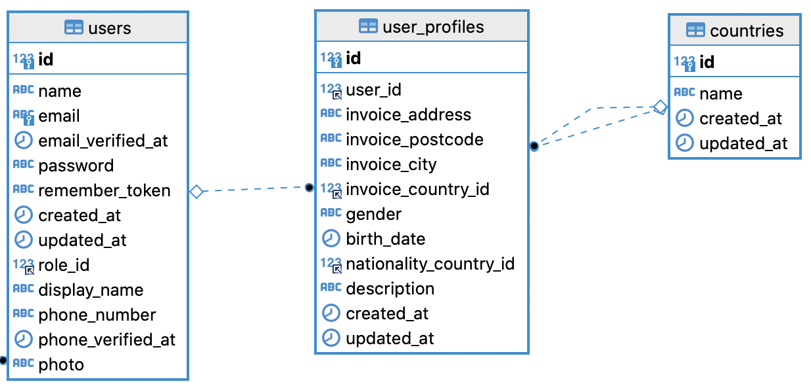
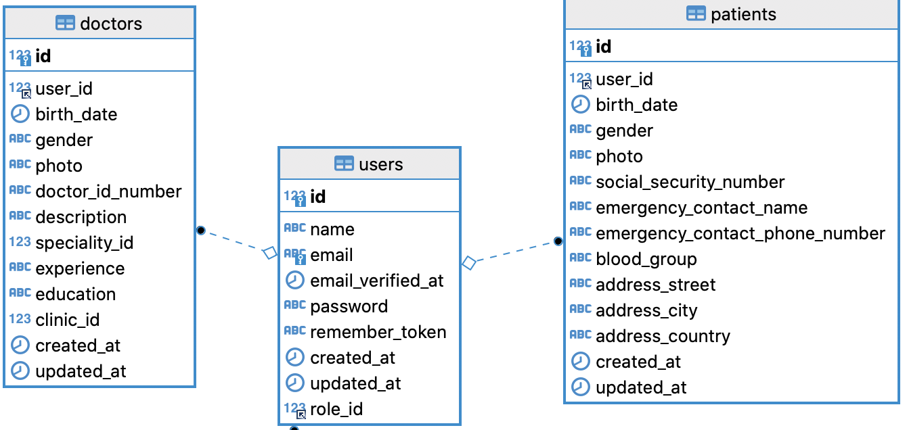

Let's take a look at another side of the user system: profile fields. Some of the fields are in this screenshot:


The main question is where do we store them and how to structure the tables, for multiple user roles?

In other words, should the property owner profile fields be in the same table as simple user fields, or do we need separate tables?

---

## Goals of This Lesson

- Think about different ways of structuring profiles in DB
- Add the necessary fields
- Look at a different project scenario: doctors/patients

By the end of this lesson, we will have this DB structure:



- - - - -

## Users Table or Profile Table?

After browsing through the booking.com website, mobile app, and help docs, I've identified these profile fields for each user role.

**Notice**: we don't really need any profile fields for administrators, as they are not visible anywhere on the app/website.

Common fields for both users/owners:

- Full name
- Display name
- Phone number
- Email and phone confirmation
- Photo
- Invoices: country, city, postcode, address

Simple users have these extra "individual" fields:

- Gender
- Nationality
- Date of birth

Then, property owners don't have to specify gender/nationality/birth date, but they have only one "special" extra field: **description** about themselves.

Yeah, it's pretty simple. Property owners have only one personal field, everything else is related to their **properties**, which we will cover in the upcoming lessons.

So, let's try to think: all the **common** fields should probably be in the `users` DB table, just some of them nullable?

Ok, let's try to create that. First, we clearly need the migration for the `countries` table:

```sh
php artisan make:model Country -m
```

**Migration**:
```php
Schema::create('countries', function (Blueprint $table) {
    $table->id();
    $table->string('name');
    $table->timestamps();
});
```

```sh
php artisan make:migration add_profile_fields_to_users_table
```

```php
Schema::table('users', function (Blueprint $table) {
    $table->string('display_name')->nullable();
    $table->string('phone_number')->nullable();
    $table->timestamp('phone_verified_at')->nullable();
    $table->string('photo')->nullable();
    $table->string('invoice_address')->nullable();
    $table->string('invoice_postcode')->nullable();
    $table->string('invoice_city')->nullable();
    $table->foreignId('invoice_country_id')->nullable()
        ->constrained('countries');
});
```

But, hmm, isn't the `users` table becoming too big, then? Should ALL of those fields be here? How often would we actually use them to query the data?

And this is where we come back to the word "simulation" again. Let's simulate what queries would there be, and what fields would actually be selected?

For viewing a user's profile somewhere, we may need `display_name` and `photo` - those should be pretty common.

But what about the data for the **invoices**? Isn't it used ONLY for invoices? And how often do we generate the invoices, once a month? Or maybe even less than that, if the user is not actively paying for anything.

So we can leave the invoice fields in the users table, but then we're risking that some other developer would blindly do `User::all()` or a similar statement, without specifying the fields, and then it would unnecessarily download all those fields into memory.

So, what I would suggest is to create a separate DB table "user_profiles" with more rarely used fields. For now, we will put only invoice-related fields there but later may add more.

So, if we change the migration above, my suggestion is this:

```sh
php artisan make:model UserProfile -m
```

**app/Models/User.php**:
```php
class User extends Authenticatable
{
    public function profile()
    {
        return $this->hasOne(UserProfile::class);
    }
}
```

**Migration for Users**:
```php
Schema::table('users', function (Blueprint $table) {
    $table->string('display_name')->nullable();
    $table->string('phone_number')->nullable();
    $table->timestamp('phone_verified_at')->nullable();
    $table->string('photo')->nullable();
});
```

**Migration for User Profiles**:
```php
Schema::create('user_profiles', function (Blueprint $table) {
    $table->id();
    $table->foreignId('user_id')->constrained();
    $table->string('invoice_address')->nullable();
    $table->string('invoice_postcode')->nullable();
    $table->string('invoice_city')->nullable();
    $table->foreignId('invoice_country_id')->nullable()->constrained('countries');
    $table->timestamps();
});
```

Now, the `User::all()` in the code would return only the main User fields, and if someone wants to know the invoice details, they would do `User::with('profile')->get()`.

Another open discussion could be around the `phone` and `phone_verified_at` fields: should they be in `users` or `user_profiles`? It depends on how you actually use them in the application. For Booking.com, they are often used as an authentication/verification mechanism, so pretty important as a **user** field. But if in your app you use them only sometimes for displaying them in the profile, then I would move them into the profile.

Finally, you may want to ask why I called the DB table `user_profiles` instead of something like `user_invoice_details`. To answer that, let's talk about extra individual fields.

-----

## Fields Per Role: Where To Store Them?

The next question is about those **extra** fields, different for every role:

- gender (User)
- nationality (User)
- birth_date (User)
- description (Property Owner)

Quite often, I see people want to create separate DB tables for every role, like "doctors" and "patients", like "teachers" and "students", because their profile fields are very different.

I would give two pieces of advice/opinion about this:

1. A little step-back, but: you should almost never replace the `users` table with multiple tables for **authentication**, repeating email/password in each of them. While it's technically possible, with [Guards](https://laravel.com/docs/9.x/authentication#specifying-a-guard), it becomes a huge headache to later maintain the same functionality in more than one place. Any doctor/patient/teacher is a User of the system, first and foremost, and individual profiles are implemented in other DB tables, with a relationship to the "users" table.

2. It makes sense to separate the profile tables only if they have many fields (10+), with most of them different per role. Otherwise, for a few fields, it's totally fine to use the same table, making some fields nullable.

With that in mind, for our specific case, it makes sense to just add those fields into the same `user_profiles` DB table, just make them nullable.

The full migration for the `user_profiles` would look like this:

```php
Schema::create('user_profiles', function (Blueprint $table) {
    $table->id();
    $table->foreignId('user_id')->constrained();
    $table->string('invoice_address')->nullable();
    $table->string('invoice_postcode')->nullable();
    $table->string('invoice_city')->nullable();
    $table->foreignId('invoice_country_id')->nullable()->constrained('countries');
    $table->string('gender')->nullable();
    $table->date('birth_date')->nullable();
    $table->foreignId('nationality_country_id')->nullable()->constrained('countries');
    $table->text('description')->nullable();
    $table->timestamps();
});
```

If we put it visually:


For this feature, I don't think it's worth creating API endpoints and tests, as it's just a simple DB table to query.

Instead, I want to dedicate some extra time to...

- - - - - 

## Doctors and Patients? 

While writing this lesson, I thought it is too simple: just one profile DB table. So decided to go a bit "off script" of this particular Booking.com project and discuss other, more complex, scenarios.

After all, the goal of this course is to discuss alternatives and explain the way to think about solutions, instead of just going "waterfall" with creating the project.

So, let's try to simulate what we would do for a typical doctor appointment system.

Again, first and foremost, both doctors and patients are **users** of the system, so we don't change anything in the `users` DB table, except for maybe adding more common and often used fields like `phone_number`.

Then, there will be two profiles with a lot of extra fields: some will be the same, and some will be different for patients and doctors.

**Patients:**

- birth_date
- gender
- photo
- social_security_number
- emergency_contact_name
- emergency_contact_phone_number
- blood_group
- address_street
- address_city
- address_country *(for simplicity, let's assume it's a string instead of foreign key)*


**Doctors:**

- birth_date
- gender
- photo
- doctor_id_number *(in some national system)*
- description
- speciality_id *(foreign key to specialities)
- experience
- education
- clinic_id *(foreign key to clinics)*


There may be more fields, but let's stop at those, you get the picture: 10+ fields for each of the roles.

In this case, we obviously shouldn't make one `user_profile` table, for two reasons:

- Too many unused fields
- Those will be queried on the different pages and API endpoints, so often patient data will be queried without the need for any doctor's record

So, what I would suggest:

```sh
php artisan make:model Patient -m
php artisan make:model Doctor -m
```

**Migrations**:
```php
Schema::create('patients', function (Blueprint $table) {
    $table->id();
    $table->foreignId('user_id')->constrained();
    $table->date('birth_date')->nullable();
    $table->string('gender')->nullable();
    $table->string('photo')->nullable();
    $table->string('social_security_number')->nullable();
    $table->string('emergency_contact_name')->nullable();
    $table->string('emergency_contact_phone_number')->nullable();
    $table->string('blood_group')->nullable();
    $table->string('address_street')->nullable();
    $table->string('address_city')->nullable();
    $table->string('address_country')->nullable();
    $table->timestamps();
});

Schema::create('doctors', function (Blueprint $table) {
    $table->id();
    $table->foreignId('user_id')->constrained();
    $table->date('birth_date')->nullable();
    $table->string('gender')->nullable();
    $table->string('photo')->nullable();
    $table->string('doctor_id_number')->nullable();
    $table->string('description')->nullable();
    $table->unsignedBigInteger('speciality_id')->nullable();
    $table->text('experience')->nullable();
    $table->text('education')->nullable();
    $table->unsignedBigInteger('clinic_id')->nullable();
    $table->timestamps();
});
```

Visually:



You may ask, why not separate a table for **repeating** profile fields like birth_date / gender / photo? 

Those ones are debatable and personal preference, you may even save them in the `users` table if you use them often. I don't see anything wrong if the fields with the same names are repeated in a few tables if they naturally belong there.

**Final thought**: I would probably suggest the same DB schema for similar situations like teachers/students, employees/employers, and others. I mean, have one `users` DB table and separate profile tables for each of the roles.
