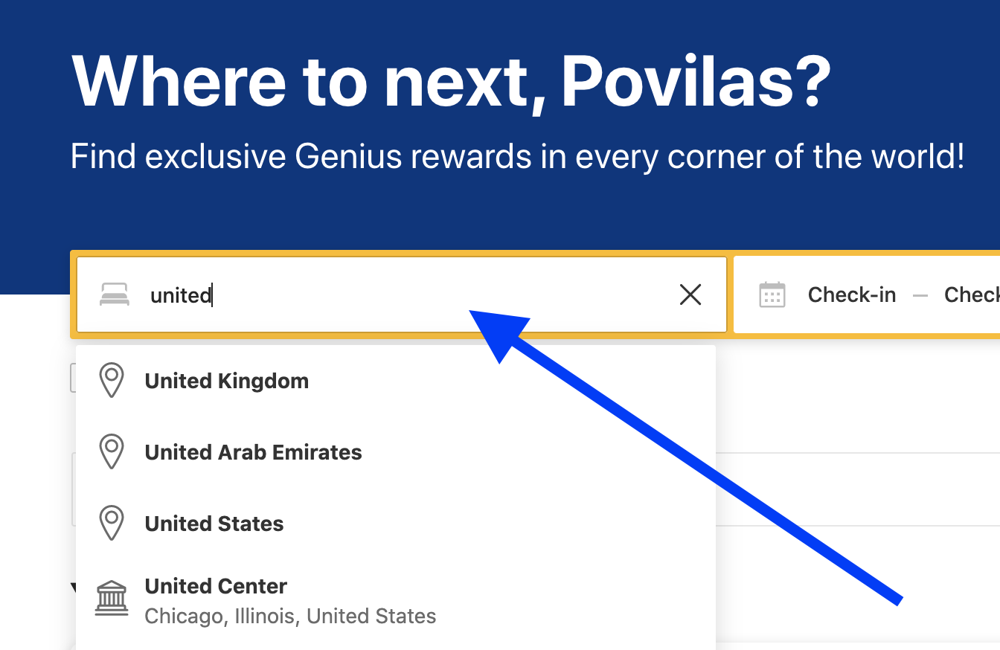
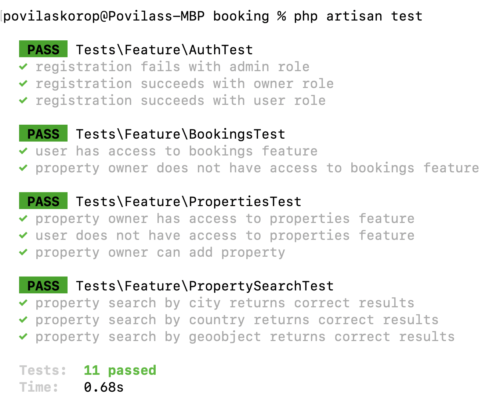
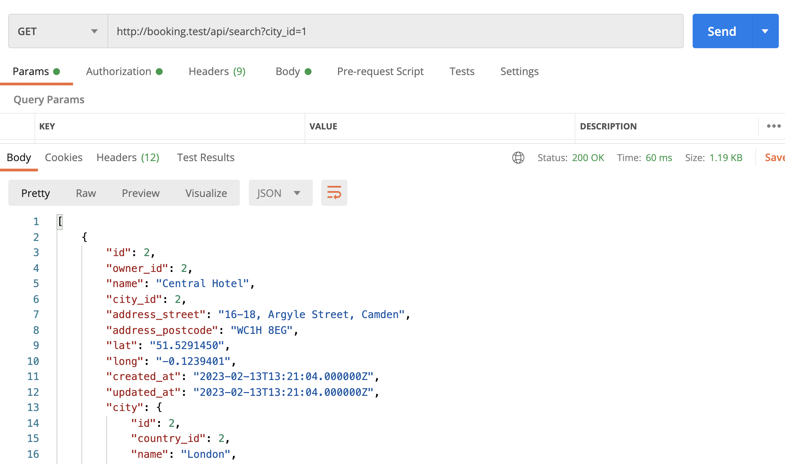
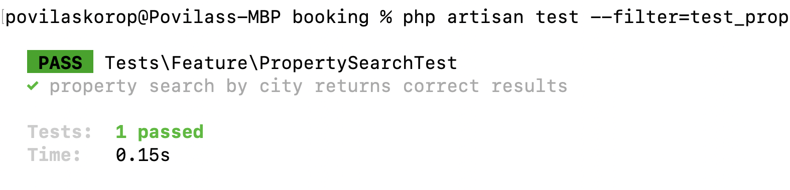
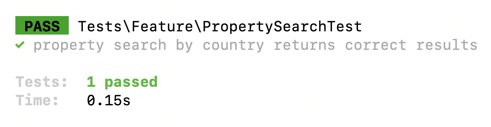

Now, that we have properties in our database, let's start building the **search**.



---

## Goals of This Lesson

- Create API endpoint (Route + Controller) for searching the properties by city, country, or geographical object
- Write PHPUnit tests for all those cases

By the end of this lesson, we will see these tests passing in Terminal:



---

## Creating Controller and Route

In later lessons, we will have more parameters for the search, but we have to start somewhere. So, for starters, we will try these criteria:

- By city
- By country
- Close to a geographical object (by its latitude/longitude)

Let's build the controller and method for this.

```sh
php artisan make:controller Public/PropertySearchController
```

**app/Http/Controllers/Public/PropertySearchController.php**:
```php
namespace App\Http\Controllers\User;

use App\Http\Controllers\Controller;
use App\Models\Property;
use Illuminate\Http\Request;

class PropertySearchController extends Controller
{
    public function __invoke(Request $request)
    {
        return Property::with('city')
            // conditions will come here
            ->get();
    }
}
```

As you can see, we're adding another namespace of `/Public`, so we'll have three zones: owner, user, and public.

And let's add the route, also grouping the owner/user routes with prefixes.

**routes/api.php**:

```php
Route::middleware('auth:sanctum')->group(function () {
    Route::prefix('owner')->group(function () {
        Route::get('properties',
            [\App\Http\Controllers\Owner\PropertyController::class, 'index']);
        Route::post('properties',
            [\App\Http\Controllers\Owner\PropertyController::class, 'store']);
    });

    Route::prefix('user')->group(function () {
        Route::get('bookings',
            [\App\Http\Controllers\User\BookingController::class, 'index']);
    });
});

Route::get('search',
    \App\Http\Controllers\Public\PropertySearchController::class);
```

Our search should be public for everyone, without any registration, so we put that route outside of the `auth:sanctum` Middleware group.

Now, let's start filling in various search cases. For that, we will use the Eloquent syntax of `Model::when()` with different conditions.

---

## Search by City

Let's assume that we have 'city' as a GET parameter, and the search is easy.

**app/Http/Controllers/Public/PropertySearchController.php**:
```php
class PropertySearchController extends Controller
{
    public function __invoke(Request $request)
    {
        return Property::with('city')
            ->when($request->city, function($query) use ($request) {
                $query->where('city_id', $request->city);
            })
            ->get();
    }
}
```

**Notice**: for now, let's return all the results without pagination and ordering, we will improve those in future lessons.

Here's what the result looks like in Postman:



And let's immediately write the test for it.

```sh
php artisan make:test PropertySearchTest
```

In the test method, we create two properties with different cities and check that only ONE is returned from the search.

To create those fake properties, we also need to create a Factory for creating the test properties: 

```sh
php artisan make:factory PropertyFactory --model=Property
```

I suggest these field values:

**database/factories/PropertyFactory.php**:
```php
namespace Database\Factories;

use App\Models\City;
use App\Models\Role;
use App\Models\User;
use Illuminate\Database\Eloquent\Factories\Factory;

class PropertyFactory extends Factory
{
    public function definition(): array
    {
        return [
            'owner_id' => User::where('role_id', Role::ROLE_OWNER)->value('id'),
            'name' => fake()->text(20),
            'city_id' => City::value('id'),
            'address_street' => fake()->streetAddress(),
            'address_postcode' => fake()->postcode(),
            'lat' => fake()->latitude(),
            'long' => fake()->longitude(),
        ];
    }
}
```

The method `value('id')` is a shorter way of doing `->first()->id`.

And then, we can finally write such a test method:

**tests/Feature/PropertySearchTest.php**:
```php
namespace Tests\Feature;

use App\Models\City;
use App\Models\Country;
use App\Models\Property;
use App\Models\Role;
use App\Models\User;
use Illuminate\Foundation\Testing\RefreshDatabase;
use Tests\TestCase;

class PropertySearchTest extends TestCase
{
    use RefreshDatabase;

    public function test_property_search_by_city_returns_correct_results(): void
    {
        $owner = User::factory()->create(['role_id' => Role::ROLE_OWNER]);
        $cities = City::take(2)->pluck('id');
        $propertyInCity = Property::factory()->create(['owner_id' => $owner->id, 'city_id' => $cities[0]]);
        $propertyInAnotherCity = Property::factory()->create(['owner_id' => $owner->id, 'city_id' => $cities[1]]);

        $response = $this->getJson('/api/search?city=' . $cities[0]);

        $response->assertStatus(200);
        $response->assertJsonCount(1);
        $response->assertJsonFragment(['id' => $propertyInCity->id]);
    }

}
```

As you can see, we're overriding a few factory values, to create properties in different cities.

**Reminder**: we have `$this->seed()` as a part of our Base TestCase, so we do have the cities in the database from those seeds.



---

## Search by Country 

The same sequence of action, the same logic, just a different filter of data in the controller.

This is our controller method now, with country search added, using `whereHas()` Eloquent method:

**app/Http/Controllers/Public/PropertySearchController.php**:
```php
class PropertySearchController extends Controller
{
    public function __invoke(Request $request)
    {
        return Property::with('city')
            ->when($request->city, function($query) use ($request) {
                $query->where('city_id', $request->city);
            })
            ->when($request->country, function($query) use ($request) {
                $query->whereHas('city', fn($q) => $q->where('country_id', $request->country));
            })
            ->get();
    }
}
```

And a new test method for this scenario, with different property values and different GET parameters to the API request:

**tests/Feature/PropertySearchTest.php**:
```php
public function test_property_search_by_country_returns_correct_results(): void
{
    $owner = User::factory()->create(['role_id' => Role::ROLE_OWNER]);
    $countries = Country::with('cities')->take(2)->get();
    $propertyInCountry = Property::factory()->create([
        'owner_id' => $owner->id,
        'city_id' => $countries[0]->cities()->value('id')
    ]);
    $propertyInAnotherCountry = Property::factory()->create([
        'owner_id' => $owner->id,
        'city_id' => $countries[1]->cities()->value('id')
    ]);

    $response = $this->getJson('/api/search?country=' . $countries[0]->id);

    $response->assertStatus(200);
    $response->assertJsonCount(1);
    $response->assertJsonFragment(['id' => $propertyInCountry->id]);
}
```

The result is another passing test!



---

## Search by Geographical Object

What if someone searches for a property near The Statue of Liberty? No problem, if we know its coordinates and then launch the search by distance, with raw SQL condition.

Another new `when()` in the Controller, with adding a Geoobject search inside.

**app/Http/Controllers/Public/PropertySearchController.php**:
```php
class PropertySearchController extends Controller
{
    public function __invoke(Request $request)
    {
        return Property::with('city')
            ->when($request->city, function($query) use ($request) {
                $query->where('city_id', $request->city);
            })
            ->when($request->country, function($query) use ($request) {
                $query->whereHas('city', fn($q) => $q->where('country_id', $request->country));
            })
            ->when($request->geoobject, function($query) use ($request) {
                $geoobject = Geoobject::find($request->geoobject);
                if ($geoobject) {
                    $condition = "(
                        6371 * acos(
                            cos(radians(" . $geoobject->lat . "))
                            * cos(radians(`lat`))
                            * cos(radians(`long`) - radians(" . $geoobject->long . "))
                            + sin(radians(" . $geoobject->lat . ")) * sin(radians(`lat`))
                        ) < 10
                    )";
                    $query->whereRaw($condition);
                }
            })
            ->get();
    }
}
```

That raw SQL query of `$condition` is taken from [this article](https://inovector.com/blog/get-locations-nearest-the-user-location-with-mysql-php-in-laravel): in our case, we're looking for properties within 10 km distance of our geoobject.

Let's test it.

**tests/Feature/PropertySearchTest.php**:
```php
public function test_property_search_by_geoobject_returns_correct_results(): void
{
    $owner = User::factory()->create(['role_id' => Role::ROLE_OWNER]);
    $cityId = City::value('id');
    $geoobject = Geoobject::first();
    $propertyNear = Property::factory()->create([
        'owner_id' => $owner->id,
        'city_id' => $cityId,
        'lat' => $geoobject->lat,
        'long' => $geoobject->long,
    ]);
    $propertyFar = Property::factory()->create([
        'owner_id' => $owner->id,
        'city_id' => $cityId,
        'lat' => $geoobject->lat + 10,
        'long' => $geoobject->long - 10,
    ]);

    $response = $this->getJson('/api/search?geoobject=' . $geoobject->id);

    $response->assertStatus(200);
    $response->assertJsonCount(1);
    $response->assertJsonFragment(['id' => $propertyNear->id]);
}
```

Again, we're creating two properties: when is at the same location as the geoobject, and another one far from it. Only one should be found in the search results.

And this is what our current test suite looks like: green!


Cool, now we have a working search by the most common geographical objects. Time to move on to other property parameters and search by them.
