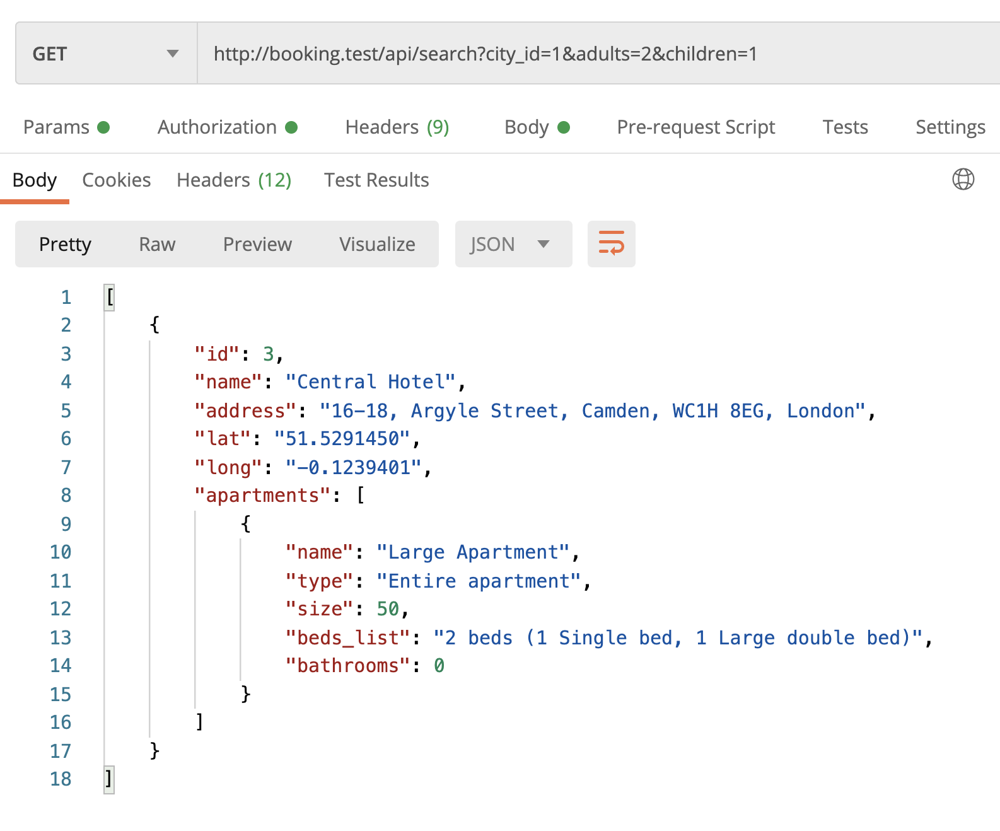
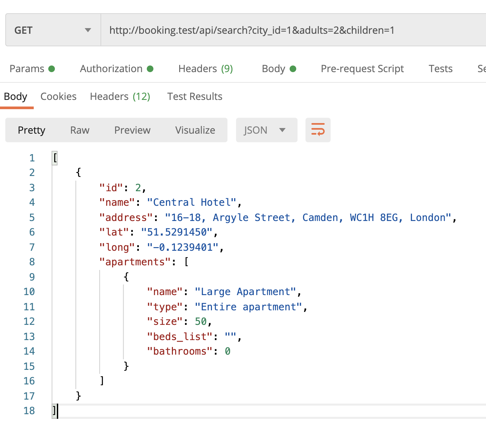
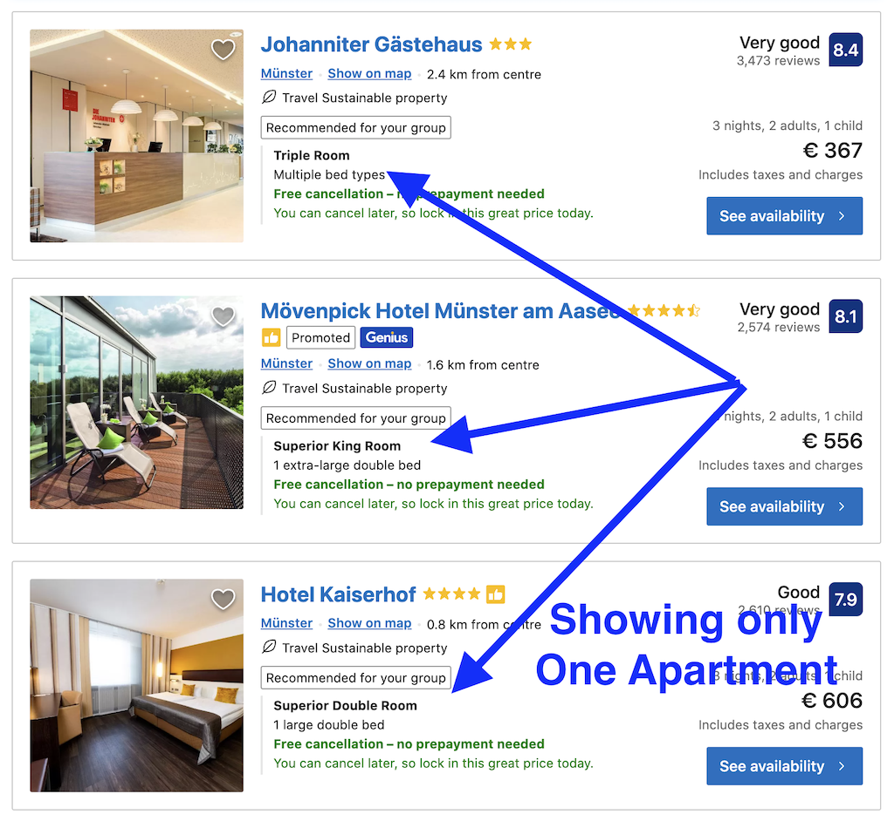
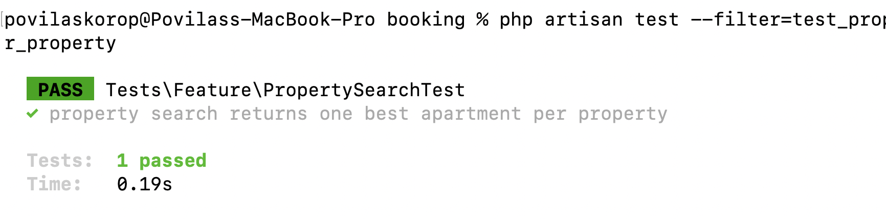

We ended up the previous lesson by returning a **huge** JSON from the property search results. Let's spend this lesson optimizing it and showing only the data that we **really** need to return.

---

## Goals of This Lesson

- Transform the returned data using Eloquent API Resources
- Create Accessors to show Addresses and Beds list in a human-friendly way
- Fix search results order/limit: showing only ONE apartment per property

By the end of this lesson, we will have this nice JSON structure in search results:



---

## Shorter JSON: Eloquent API Resources

A quick reminder of how it looks now.

Endpoint: `/api/search?city_id=1&adults=2&children=1`

**Result JSON**:
```json
[
    {
        "id": 2,
        "owner_id": 2,
        "name": "Central Hotel",
        "city_id": 2,
        "address_street": "16-18, Argyle Street, Camden",
        "address_postcode": "WC1H 8EG",
        "lat": "51.5291450",
        "long": "-0.1239401",
        "created_at": "2023-02-13T13:21:04.000000Z",
        "updated_at": "2023-02-13T13:21:04.000000Z",
        "city": {
            "id": 2,
            "country_id": 2,
            "name": "London",
            "lat": "51.5073510",
            "long": "-0.1277580",
            "created_at": "2023-02-13T09:04:51.000000Z",
            "updated_at": "2023-02-13T09:04:51.000000Z"
        },
        "apartments": [
            {
                "id": 2,
                "apartment_type_id": 1,
                "property_id": 2,
                "name": "Large Apartment",
                "capacity_adults": 3,
                "capacity_children": 2,
                "created_at": "2023-02-27T11:33:41.000000Z",
                "updated_at": "2023-02-27T11:33:41.000000Z",
                "size": 50,
                "bathrooms": 0,
                "apartment_type": {
                    "id": 1,
                    "name": "Entire apartment",
                    "created_at": "2023-02-28T09:02:54.000000Z",
                    "updated_at": "2023-02-28T09:02:54.000000Z"
                },
                "rooms": [
                    {
                        "id": 1,
                        "apartment_id": 2,
                        "room_type_id": 1,
                        "name": "Bedroom",
                        "created_at": "2023-03-02T10:07:05.000000Z",
                        "updated_at": "2023-03-02T10:07:05.000000Z",
                        "beds": [
                            {
                                "id": 1,
                                "room_id": 1,
                                "bed_type_id": 1,
                                "name": null,
                                "created_at": "2023-03-02T10:08:22.000000Z",
                                "updated_at": "2023-03-02T10:08:22.000000Z",
                                "bed_type": {
                                    "id": 1,
                                    "name": "Single bed",
                                    "created_at": "2023-03-02T07:37:43.000000Z",
                                    "updated_at": "2023-03-02T07:37:43.000000Z"
                                }
                            },
                            {
                                "id": 2,
                                "room_id": 1,
                                "bed_type_id": 2,
                                "name": null,
                                "created_at": "2023-03-02T10:08:22.000000Z",
                                "updated_at": "2023-03-02T10:08:22.000000Z",
                                "bed_type": {
                                    "id": 2,
                                    "name": "Large double bed",
                                    "created_at": "2023-03-02T07:37:43.000000Z",
                                    "updated_at": "2023-03-02T07:37:43.000000Z"
                                }
                            }
                        ]
                    },
                    {
                        "id": 2,
                        "apartment_id": 2,
                        "room_type_id": 2,
                        "name": "Living Room",
                        "created_at": "2023-03-02T10:07:05.000000Z",
                        "updated_at": "2023-03-02T10:07:05.000000Z",
                        "beds": []
                    }
                ]
            }
        ]
    }
]
```

Great, so we're delivering the data from the API, now front-end client may actually calculate how many beds there are and what type/size, right?

But maybe we can help and calculate it on-the-fly on the server? 

Of course, it's a personal preference, but another argument would be that JSON result is really getting huge, although if we strip out all the things that we don't need, we're left with something like this:

```json
[
    {
        "id": 2,
        "name": "Central Hotel",
        "address_street": "16-18, Argyle Street, Camden",
        "address_postcode": "WC1H 8EG",
        "lat": "51.5291450",
        "long": "-0.1239401",
        "city": {
            "name": "London",
        },
        "apartments": [
            {
                "name": "Large Apartment",
                "capacity_adults": 3,
                "capacity_children": 2,
                "size": 50,
                "bathrooms": 0,
                "apartment_type": {
                    "name": "Entire apartment",
                },
                "rooms": [
                    {
                        "name": "Bedroom",
                        "beds": [
                            {
                                "name": null,
                                "bed_type": {
                                    "name": "Single bed",
                                }
                            },
                            {
                                "name": null,
                                "bed_type": {
                                    "name": "Large double bed",
                                }
                            }
                        ]
                    },
                    {
                        "name": "Living Room",
                        "beds": []
                    }
                ]
            }
        ]
    }
]
```

And not even that, but what our front-end actually needs is this summary:

```json
[
    {
        "id": 2,
        "name": "Central Hotel",
        "address": "16-18, Argyle Street, Camden, WC1H 8EG, London",
        "lat": "51.5291450",
        "long": "-0.1239401",
        "apartments": [
            {
                "name": "Large Apartment",
                "type": "Entire apartment",
                "size": 50,
                "beds_list": "2 beds (1 single, 1 large double)",
                "bathrooms": 0,
            }
        ]
    }
]
```

So, let's work on this transformation, loading only the data that we need, and transforming some of the DB data into more useful string values.

For that, we will use [Eloquent API Resources](https://laravel.com/docs/10.x/eloquent-resources).

We will generate two of them, at once:

```sh
php artisan make:resource PropertySearchResource
php artisan make:resource ApartmentSearchResource
```

As you can see, we deliberately named them **Search** Resources, because in other cases, those models may need to return other fields, as we likely see later in this course.

Then, personally, I like to disable the default [wrapping feature](https://laravel.com/docs/10.x/eloquent-resources#data-wrapping) of API Resources, so it wouldn't return the "data" layer by default. We add this code to the Service Provider.

**app/Providers/AppServiceProvider.php**:
```php
use Illuminate\Http\Resources\Json\JsonResource;

class AppServiceProvider extends ServiceProvider
{
    public function boot()
    {
        JsonResource::withoutWrapping();
    }
}
```

Next, we define what columns to return for the property:

**app/Http/Resources/PropertySearchResource.php**:
```php
class PropertySearchResource extends JsonResource
{
    public function toArray(Request $request): array
    {
        return [
            'id' => $this->id,
            'name' => $this->name,
            'address' => $this->address,
            'lat' => $this->lat,
            'long' => $this->long,
            'apartments' => ApartmentSearchResource::collection($this->apartments),
        ];
    }
}
```

So, we return only the fields we want, transform the address (*more on that below*) and return the apartments list, too.

We will get to the apartments a bit later, but for now, let's stop at the **address**. There's no such direct column in the DB, so we need to create an Attribute to concat that string from the street address, postcode, and city.

**app/Models/Property.php**:
```php
use Illuminate\Database\Eloquent\Casts\Attribute;

class Property extends Model
{
    // ...

    public function address(): Attribute
    {
        return new Attribute(
            get: fn () => $this->address_street 
                 . ', ' . $this->address_postcode 
                 . ', ' . $this->city->name
        );
    }
}
```

And then we use that PropertySearchResource in our Controller:

**app/Http/Controllers/Public/PropertySearchController.php**:
```php
use App\Http\Resources\PropertySearchResource;

class PropertySearchController extends Controller
{
    public function __invoke(Request $request)
    {
        $properties = Property::query()
            // ->with(...)
            // ->when(...)
            ->get();

        return PropertySearchResource::collection($properties);
    }
}
```

At this point, as we haven't done anything with Apartments, the result in Postman would still look huge. See below: we've taken care of the property fields like address, but apartments are still a big array.

```json
[
    {
        "id": 2,
        "name": "Central Hotel",
        "address": "16-18, Argyle Street, Camden, WC1H 8EG, London",
        "lat": "51.5291450",
        "long": "-0.1239401",
        "apartments": [
            {
                "id": 2,
                "apartment_type_id": 1,
                "property_id": 2,
                "name": "Large Apartment",
                "capacity_adults": 3,
                "capacity_children": 2,
                "created_at": "2023-02-27T11:33:41.000000Z",
                "updated_at": "2023-02-27T11:33:41.000000Z",
                "size": 50,
                "bathrooms": 0,
                "apartment_type": {
                    "id": 1,
                    "name": "Entire apartment",
                    "created_at": "2023-02-28T09:02:54.000000Z",
                    "updated_at": "2023-02-28T09:02:54.000000Z"
                },
                "rooms": [
                    {
                        "id": 1,
                        "apartment_id": 2,
                        "room_type_id": 1,
                        "name": "Bedroom",
                        "created_at": "2023-03-02T10:07:05.000000Z",
                        "updated_at": "2023-03-02T10:07:05.000000Z",
                        "beds": []
                    },
                    {
                        "id": 2,
                        "apartment_id": 2,
                        "room_type_id": 2,
                        "name": "Living Room",
                        "created_at": "2023-03-02T10:07:05.000000Z",
                        "updated_at": "2023-03-02T10:07:05.000000Z",
                        "beds": [
                            {
                                "id": 1,
                                "room_id": 2,
                                "bed_type_id": 1,
                                "name": null,
                                "created_at": "2023-03-02T10:08:22.000000Z",
                                "updated_at": "2023-03-02T10:08:22.000000Z",
                                "bed_type": {
                                    "id": 1,
                                    "name": "Single bed",
                                    "created_at": "2023-03-02T07:37:43.000000Z",
                                    "updated_at": "2023-03-02T07:37:43.000000Z"
                                }
                            },
                            {
                                "id": 2,
                                "room_id": 2,
                                "bed_type_id": 1,
                                "name": null,
                                "created_at": "2023-03-02T10:08:22.000000Z",
                                "updated_at": "2023-03-02T10:08:22.000000Z",
                                "bed_type": {
                                    "id": 1,
                                    "name": "Single bed",
                                    "created_at": "2023-03-02T07:37:43.000000Z",
                                    "updated_at": "2023-03-02T07:37:43.000000Z"
                                }
                            }
                        ]
                    }
                ],
                "beds": [
                    {
                        "id": 1,
                        "room_id": 2,
                        "bed_type_id": 1,
                        "name": null,
                        "created_at": "2023-03-02T10:08:22.000000Z",
                        "updated_at": "2023-03-02T10:08:22.000000Z",
                        "laravel_through_key": 2,
                        "bed_type": {
                            "id": 1,
                            "name": "Single bed",
                            "created_at": "2023-03-02T07:37:43.000000Z",
                            "updated_at": "2023-03-02T07:37:43.000000Z"
                        }
                    },
                    {
                        "id": 2,
                        "room_id": 2,
                        "bed_type_id": 1,
                        "name": null,
                        "created_at": "2023-03-02T10:08:22.000000Z",
                        "updated_at": "2023-03-02T10:08:22.000000Z",
                        "laravel_through_key": 2,
                        "bed_type": {
                            "id": 1,
                            "name": "Single bed",
                            "created_at": "2023-03-02T07:37:43.000000Z",
                            "updated_at": "2023-03-02T07:37:43.000000Z"
                        }
                    }
                ]
            }
        ]
    }
]
```

Now, let's transform the Apartment list.

**app/Http/Resources/ApartmentSearchResource.php**:
```php
class ApartmentSearchResource extends JsonResource
{
    public function toArray(Request $request): array
    {
        return [
            'name' => $this->name,
            'type' => $this->apartment_type?->name,
            'size' => $this->size,
            'beds_list' => '', // coming soon
            'bathrooms' => $this->bathrooms,
        ];
    }
}
```

Everything is pretty clear here, except maybe noticing that `->apartment_type?` is with a question mark, as it may be nullable, so we want to prevent errors. Read more about it [in this article](https://laraveldaily.com/post/laravel-relation-attempt-to-read-property-on-null-error).

The result is MUCH better now, even fits on the screen to provide the Postman screenshot!



Now, the `beds_list` part.

- - - - -

## Populating List of Beds

This string of the list of beds is more complicated than seemed to me at first. Here are possible cases:

- No beds at all: `beds_list` should return an empty string
- One bed: should return "1 [bed_type.name]" like `1 Single bed`
- Two beds of the same type: return "X [bed_type.name]s" pluralized like `2 Single beds`
- 2+ beds of different types: return "X beds (Y [type 1], Z [type 2])" like `2 beds (1 single bed, 1 large bed)`

See how complex? Now, let's try to create an Eloquent Attribute for this.

**app/Models/Appartment.php**:
```php
use Illuminate\Database\Eloquent\Casts\Attribute;

class Apartment extends Model
{
    public function beds()
    {
        return $this->hasManyThrough(Bed::class, Room::class);
    }

    public function bedsList(): Attribute
    {
        $allBeds = $this->beds;
        $bedsByType = $allBeds->groupBy('bed_type.name');
        $bedsList = '';
        if ($bedsByType->count() == 1) {
            $bedsList = $allBeds->count() . ' ' . str($bedsByType->keys()[0])->plural($allBeds->count());
        } else if ($bedsByType->count() > 1) {
            $bedsList = $allBeds->count() . ' ' . str('bed')->plural($allBeds->count());
            $bedsListArray = [];
            foreach ($bedsByType as $bedType => $beds) {
                $bedsListArray[] = $beds->count() . ' ' . str($bedType)->plural($beds->count());
            }
            $bedsList .= ' ('.implode(', ' , $bedsListArray) .')';
        }

        return new Attribute(
            get: fn () => $bedsList
        );
    }
}
```

Looks complex, doesn't it? This is what I came up with, after a few rewrites, maybe you would have an even better solution.

A few things to explain here:

- I created a separate `hasManyThrough()` relationship to beds, for a more convenient query like `$this->beds`, read about HasManyThrough in [Laravel docs](https://laravel.com/docs/10.x/eloquent-relationships#has-many-through)
- When we query that Collection, I use the `groupBy()` method on the Collection, to have them grouped by type. And then if it's one type - then just show that type as a string, otherwise - do a `foreach` loop to concatenate the final string
- For pluralizing, I use `str($string)->plural($number)` Laravel helper, which would transform `str("bed")->plural(2)` into `beds`

This is the result in Postman:


-----

## Feature Test for Bed String

Now, as we have such complex logic, it's important to test all the possible cases, right? You can, of course, do it manually (*and should!*) but wouldn't it be better that some "robot" would do it for us? Oh right, we have automated tests set up!

In this case, we will write quite an interesting automated test, I would call it "all-in-one". We will simulate many scenarios, assert the results and build up into more and more complex cases.

**tests/Feature/PropertySearchTest.php**:
```php
public function test_property_search_beds_list_all_cases(): void
{
    $owner = User::factory()->create(['role_id' => Role::ROLE_OWNER]);
    $cityId = City::value('id');
    $roomTypes = RoomType::all();
    $bedTypes = BedType::all();

    $property = Property::factory()->create([
        'owner_id' => $owner->id,
        'city_id' => $cityId,
    ]);
    $apartment = Apartment::factory()->create([
        'name' => 'Small apartment',
        'property_id' => $property->id,
        'capacity_adults' => 1,
        'capacity_children' => 0,
    ]);

    // ----------------------
    // FIRST: check that bed list if empty if no beds
    // ----------------------

    $response = $this->getJson('/api/search?city=' . $cityId);
    $response->assertStatus(200);
    $response->assertJsonCount(1);
    $response->assertJsonCount(1, '0.apartments');
    $response->assertJsonPath('0.apartments.0.beds_list', '');

    // ----------------------
    // SECOND: create 1 room with 1 bed
    // ----------------------

    $room = Room::create([
        'apartment_id' => $apartment->id,
        'room_type_id' => $roomTypes[0]->id,
        'name' => 'Bedroom',
    ]);
    Bed::create([
        'room_id' => $room->id,
        'bed_type_id' => $bedTypes[0]->id,
    ]);

    $response = $this->getJson('/api/search?city=' . $cityId);
    $response->assertStatus(200);
    $response->assertJsonPath('0.apartments.0.beds_list', '1 ' . $bedTypes[0]->name);

    // ----------------------
    // THIRD: add another bed to the same room
    // ----------------------

    Bed::create([
        'room_id' => $room->id,
        'bed_type_id' => $bedTypes[0]->id,
    ]);
    $response = $this->getJson('/api/search?city=' . $cityId);
    $response->assertStatus(200);
    $response->assertJsonPath('0.apartments.0.beds_list', '2 ' . str($bedTypes[0]->name)->plural());

    // ----------------------
    // FOURTH: add a second room with no beds
    // ----------------------

    $secondRoom = Room::create([
        'apartment_id' => $apartment->id,
        'room_type_id' => $roomTypes[0]->id,
        'name' => 'Living room',
    ]);
    $response = $this->getJson('/api/search?city=' . $cityId);
    $response->assertStatus(200);
    $response->assertJsonPath('0.apartments.0.beds_list', '2 ' . str($bedTypes[0]->name)->plural());

    // ----------------------
    // FIFTH: add one bed to that second room
    // ----------------------

    Bed::create([
        'room_id' => $room->id,
        'bed_type_id' => $bedTypes[0]->id,
    ]);
    $response = $this->getJson('/api/search?city=' . $cityId);
    $response->assertStatus(200);
    $response->assertJsonPath('0.apartments.0.beds_list', '3 ' . str($bedTypes[0]->name)->plural());

    // ----------------------
    // SIXTH: add another bed with a different type to that second room
    // ----------------------

    Bed::create([
        'room_id' => $room->id,
        'bed_type_id' => $bedTypes[1]->id,
    ]);
    $response = $this->getJson('/api/search?city=' . $cityId);
    $response->assertStatus(200);
    $response->assertJsonPath('0.apartments.0.beds_list', '4 beds (3 ' . str($bedTypes[0]->name)->plural() . ', 1 ' . $bedTypes[1]->name . ')');

    // ----------------------
    // SEVENTH: add a second bed with that new type to that second room
    // ----------------------

    Bed::create([
        'room_id' => $room->id,
        'bed_type_id' => $bedTypes[1]->id,
    ]);
    $response = $this->getJson('/api/search?city=' . $cityId);
    $response->assertStatus(200);
    $response->assertJsonPath('0.apartments.0.beds_list', '5 beds (3 ' . str($bedTypes[0]->name)->plural() . ', 2 ' . str($bedTypes[1]->name)->plural() . ')');
}
```

**Notice**: it's only **one** way to write such a test, some developers would disagree with such an approach, as it is believed that every test method should test one specific scenario. But I believe that, in this case, convenience is more important than theoretical principles.

Another popular alternative to writing such a test is to have it as a **Unit** test instead of a Feature test. We could separate the Attribute into its own method and would call that method with various parameters, asserting the correct results each time. In that case, we would not call the API or DB directly, as we would test a specific **unit** of code - method to transform rooms/beds data into a string of beds information. But in this lesson I decided not to show this approach, as it requires changing quite a lot in our structure, we better move on to creating more features of our application.

- - - - 

## Order/Limit: Show ONE Apartment Per Property

One more "unplanned" thing.

While browsing booking.com I noticed something I had missed earlier: that search results show properties with only ONE apartment each, not all apartments. 



So let's fix this now, while we're still working on this JSON of search results. 

What is the condition of which one apartment to show? We could actually only guess, but I think it should be something like *"the most suitable"* in terms of size and capacity.

For example, if I'm searching for an apartment for 2 adults and 1 child, and the property has an apartment with a capacity for 2 adults + 1 child, and another one for 3 adults + 2 children, guess which one we should show? Correct, the smaller one.

In other words, we need to order the apartments by capacity for adults and then by capacity for children, and then take only one row.

To order the apartments relationship records and take only ONE of them, we need to add the ordering condition into the `withWhereHas()` method:

**app/Http/Controllers/Public/PropertySearchController.php**:
```php
class PropertySearchController extends Controller
{
    public function __invoke(Request $request)
    {
        $properties = Property::query()
            // ... other ->when() conditions
            ->when($request->adults && $request->children, function($query) use ($request) {
                $query->withWhereHas('apartments', function($query) use ($request) {
                    $query->where('capacity_adults', '>=', $request->adults)
                        ->where('capacity_children', '>=', $request->children)
                        ->orderBy('capacity_adults') // [tl! add:start]
                        ->orderBy('capacity_children')
                        ->take(1); // [tl! add:end] 
                });
            })
            ->get();

        return PropertySearchResource::collection($properties);
    }
}
```

Visually, our result shouldn't change, as we've been testing only the case of one apartment per property, anyway.

But as proof, let's write a feature test method for it.

**tests/Feature/PropertySearchTest.php**:
```php
public function test_property_search_returns_one_best_apartment_per_property()
{
    $owner = User::factory()->create(['role_id' => Role::ROLE_OWNER]);
    $cityId = City::value('id');
    $property = Property::factory()->create([
        'owner_id' => $owner->id,
        'city_id' => $cityId,
    ]);
    $largeApartment = Apartment::factory()->create([
        'name' => 'Large apartment',
        'property_id' => $property->id,
        'capacity_adults' => 3,
        'capacity_children' => 2,
    ]);
    $midSizeApartment = Apartment::factory()->create([
        'name' => 'Mid size apartment',
        'property_id' => $property->id,
        'capacity_adults' => 2,
        'capacity_children' => 1,
    ]);
    $smallApartment = Apartment::factory()->create([
        'name' => 'Small apartment',
        'property_id' => $property->id,
        'capacity_adults' => 1,
        'capacity_children' => 0,
    ]);

    $response = $this->getJson('/api/search?city=' . $cityId . '&adults=2&children=1');

    $response->assertStatus(200);
    $response->assertJsonCount(1, '0.apartments');
    $response->assertJsonPath('0.apartments.0.name', $midSizeApartment->name);
}
```

I deliberately created the larger apartment first, so the SQL query would naturally return it first if it's not reordered, which is proof that our "best size fit" ordering works well.

We're launching the test, and... green.



**Notice**: this is future Povilas writing. Here, with `take(1)` I actually introduced a bug, it works differently than I expected. But I will deliberately leave it here, as we will fix it in a few lessons, at the time when I actually discover that bug.