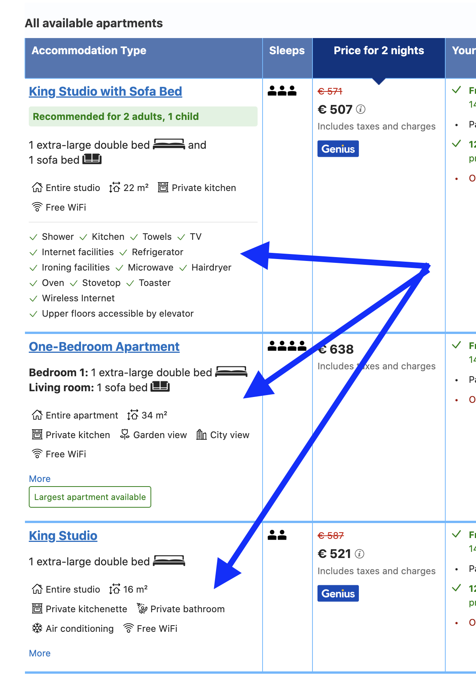
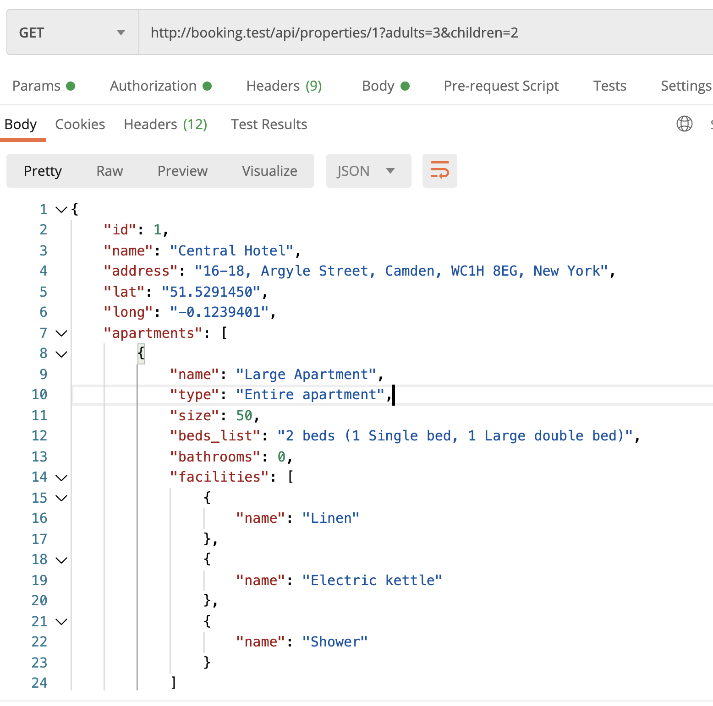
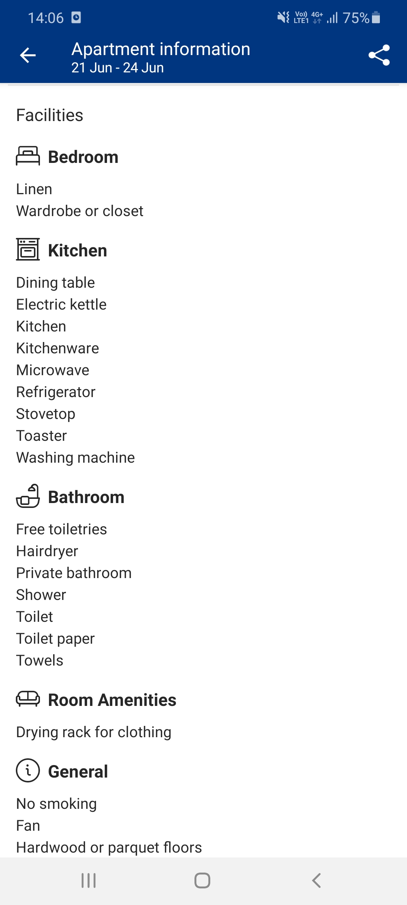
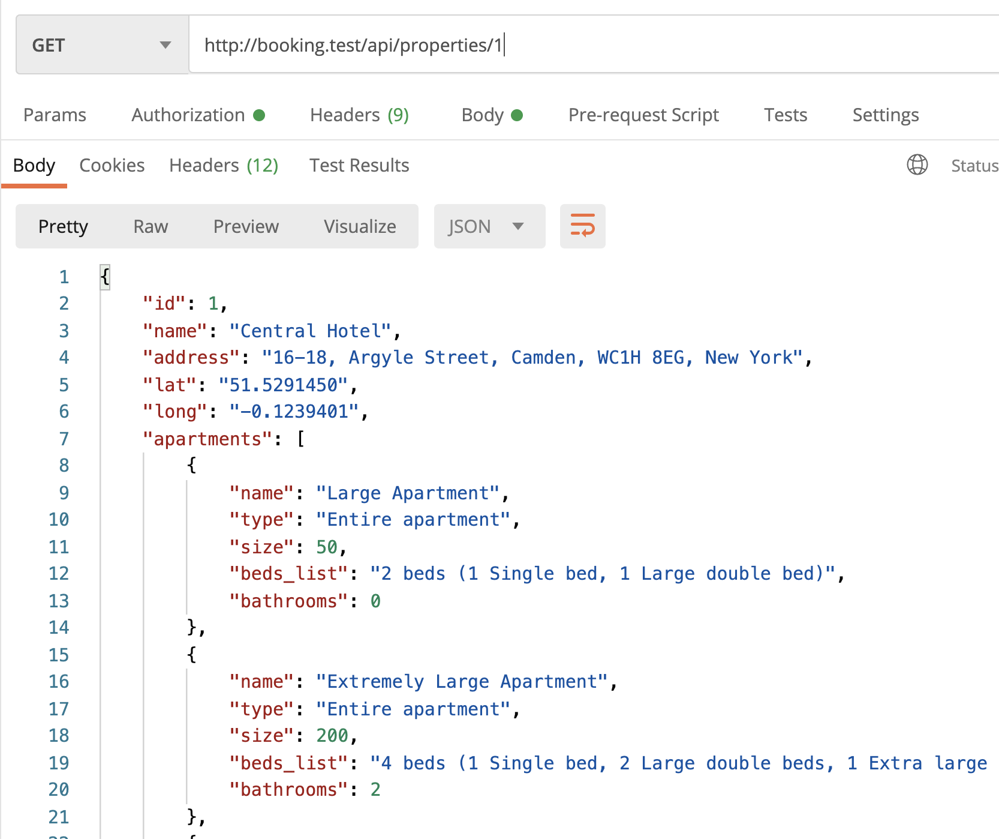

Now imagine the user clicking on the property to choose the apartment. Inside the property view, we need to show the full list of available apartments, with their **facilities**:



The **Facility** model will be a new thing in this lesson. 

---

## Goals of This Lesson

- Build Facility DB/relationship structure
- Show facilities in the new Show Property endpoint

By the end of this lesson, we will have this list of facilities showing in Postman:



---

## Facilities: DB Structure

An obvious question: what are those facilities, and what are the different options and categories for them? There could be dozens or even hundreds of various facilities.

I've found the answer to this question while browsing the **mobile** version of Booking.com, which showed the apartment facilities in a well-structured way:



So I imagine structuring something like this:

**facility_categories**:

- id
- name


**facilities**

- id
- category_id
- name


**apartment_facility**

- apartment_id
- facility_id


Let's create exactly that.

```sh
php artisan make:model FacilityCategory -ms
```

Notice that I generate the model with **seeder** this time, with a flag `-s`.

**Migration file**:
```php
public function up(): void
{
    Schema::create('facility_categories', function (Blueprint $table) {
        $table->id();
        $table->string('name');
        $table->timestamps();
    });
}
```

**app/Models/FacilityCategory.php**:
```php
class FacilityCategory extends Model
{
    use HasFactory;

    protected $fillable = ['name'];
}
```

And let's add the categories for the seeder. This time, different from other lessons, I will do that in a separate seeder, cause that list is likely to change in the future, not so static.

**database/seeders/FacilityCategorySeeder.php**:
```php
namespace Database\Seeders;

use App\Models\FacilityCategory;

class FacilityCategorySeeder extends Seeder
{
    public function run(): void
    {
        FacilityCategory::create(['name' => 'Bedroom']);
        FacilityCategory::create(['name' => 'Kitchen']);
        FacilityCategory::create(['name' => 'Bathroom']);
        FacilityCategory::create(['name' => 'Room Amenities']);
        FacilityCategory::create(['name' => 'General']);
        FacilityCategory::create(['name' => 'Media & Technology']);
    }
}
```

Same with Facilities.

```sh
php artisan make:model Facility -ms
```

**Migration file**:
```php
public function up(): void
{
    Schema::create('facilities', function (Blueprint $table) {
        $table->id();
        $table->foreignId('category_id')
            ->nullable()
            ->references('id')
            ->on('facility_categories');
        $table->string('name');
        $table->timestamps();
    });
}
```

Notice that I specify `nullable()` this time, just in case - maybe there will be a separate facility without categories.

Also, instead of `constrained()`, I specify `references()->on()`, because the table name is not `categories`, as the default `facilities.category_id` field name would expect.

**app/Models/Facility.php**:
```php
class Facility extends Model
{
    use HasFactory;

    protected $fillable = ['category_id', 'name'];

    public function category()
    {
        return $this->belongsTo(FacilityCategory::class, 'category_id');
    }
}
```

Also, I think it's logical to create a `hasMany()` relationship right away, as I feel we will use it in the lists.

**app/Models/FacilityCategory.php**:
```php
class FacilityCategory extends Model
{
    // ...

    public function facilities()
    {
        return $this->hasMany(Facility::class, 'category_id');
    }
}
```

Similarly, let's seed a few facilities, I will take them from the same mobile screenshot above.

**database/seeders/FacilitySeeder.php**:
```php
use App\Models\Facility;

class FacilitySeeder extends Seeder
{
    public function run(): void
    {
        Facility::create(['category_id' => 1, 'name' => 'Linen']);
        Facility::create(['category_id' => 1, 'name' => 'Wardrobe or closet']);
        Facility::create(['category_id' => 2, 'name' => 'Electric kettle']);
        Facility::create(['category_id' => 2, 'name' => 'Microwave']);
        Facility::create(['category_id' => 2, 'name' => 'Washing mashine']);
        Facility::create(['category_id' => 3, 'name' => 'Private bathroom']);
        Facility::create(['category_id' => 3, 'name' => 'Shower']);
        Facility::create(['category_id' => 3, 'name' => 'Towels']);
        Facility::create(['category_id' => 4, 'name' => 'Drying rack for clothing']);
        Facility::create(['category_id' => 5, 'name' => 'No smoking']);
        Facility::create(['category_id' => 5, 'name' => 'Fan']);
        Facility::create(['category_id' => 6, 'name' => 'WiFi']);
        Facility::create(['category_id' => 6, 'name' => 'TV']);
    }
}
```

Finally, I add both new Seeder files into the main one.

**database/seeders/DatabaseSeeder.php**:
```php
class DatabaseSeeder extends Seeder
{
    public function run()
    {
        $this->call(RoleSeeder::class);
        $this->call(AdminUserSeeder::class);
        $this->call(PermissionSeeder::class);

        $this->call(CountrySeeder::class);
        $this->call(CitySeeder::class);
        $this->call(GeoobjectSeeder::class);

        $this->call(FacilityCategorySeeder::class);
        $this->call(FacilitySeeder::class);
    }
}
```

So, we have the structure for the facilities and categories, now let's attach them to the **Apartments**, with a many-to-many pivot table.

```sh
php artisan make:migration create_apartment_facility_table
```

**Migration file**:
```
public function up(): void
{
    Schema::create('apartment_facility', function (Blueprint $table) {
        $table->foreignId('apartment_id')->constrained();
        $table->foreignId('facility_id')->constrained();
    });
}
```

And let's add a relationship: for now, from the apartment side.

**app/Models/Apartment.php**:
```php
class Apartment extends Model
{
    // ...

    public function facilities()
    {
        return $this->belongsToMany(Facility::class);
    }
}
```

Ok great, now we have the data. Next, how do we **show** that data?

---

## Property: Show Apartments with Facilities

Let's get back to the initial screenshot from Booking.com, at the beginning of this lesson. I will repeat it here.


This is the page that you get after clicking on a specific property from the search result. We don't have that endpoint yet, so let's create it.

It will be a new controller, a public one, to show property details.

```sh
php artisan make:controller Public/PropertyController --invokable
```

Similarly to Search, it will be an **invokable** Controller, with only one method. The difference here is that we will use Route Model Binding to pass `properties.id` as a parameter.

And, for now, let's just try to re-use the same API Resource of Search to return the response.

**app/Http/Controllers/Public/PropertyController.php**:
```php
namespace App\Http\Controllers\Public;

use App\Http\Controllers\Controller;
use App\Http\Resources\PropertySearchResource;
use App\Models\Property;
use Illuminate\Http\Request;
use Illuminate\Http\Response;

class PropertyController extends Controller
{
    public function __invoke(Property $property, Request $request): Response
    {
        return new PropertySearchResource($property);
    }
}
```

Next, let's build the API route for this:

**routes/api.php**:
```php
Route::get('search',
    \App\Http\Controllers\Public\PropertySearchController::class);
Route::get('properties/{property}',
    \App\Http\Controllers\Public\PropertyController::class);
```

And if we launch it in Postman, the result is this:



Success! Simple, right?

But not so fast, we need to make one tweak here: show only **suitable** apartments from the search.

We do need to still pass the same parameters of search like `adults` and `children`. If you searched, you would like the same search query to remain inside the property page, right?

So, here's where our `Request $request` parameter comes in, we filter and order the property apartments in a similar way, like in search. 

**app/Http/Controllers/Public/PropertyController.php**:
```php
public function __invoke(Property $property, Request $request)
{
    if ($request->adults && $request->children) {
        $property->load(['apartments' => function ($query) use ($request) {
            $query->where('capacity_adults', '>=', $request->adults)
                ->where('capacity_children', '>=', $request->children)
                ->orderBy('capacity_adults')
                ->orderBy('capacity_children');
        }]);
    }

    return new PropertySearchResource($property);
}
```

Here, we use `->load()` instead of `->withWhereHas()` because we don't need to search anymore, we already know that property is suitable, and we have its object in `$property`, so we just need to **load** the relationship, which isn't loaded by default with route model binding.

Now, we can call this API endpoint like this: `/api/properties/1?adults=3&children=2`.

Next, we get to show the main topic of this lesson: showing **facilities**.

Of course, we can load them with the relationship, right?

But first, to show the facilities, let's create their own API Resource:

```sh
php artisan make:resource FacilityResource
```

For now, let's just show the name of the facility.

**app/Http/Resources/FacilityResource.php**:
```php
class FacilityResource extends JsonResource
{
    public function toArray(Request $request): array
    {
        return [
            'name' => $this->name,
        ];
    }
}
```

Then, we load that FacilityResource as a part of another `ApartmentSearchResource`:

**app/Http/Resources/ApartmentSearchResource.php**:
```php
class ApartmentSearchResource extends JsonResource
{
    public function toArray(Request $request): array
    {
        return [
            'name' => $this->name,
            'type' => $this->apartment_type?->name,
            'size' => $this->size,
            'beds_list' => $this->beds_list,
            'bathrooms' => $this->bathrooms,
            'facilities' => $this->whenLoaded('facilities', FacilityResource::collection($this->facilities)),
        ];
    }
}
```

See that `$this->whenLoaded()`? It means that it will show the `facilities` field only if it's eager-loaded from the Controller. This is a performance optimization to avoid too many queries and loading too much unneeded data.

So this is exactly what we'll do in Controller.

**app/Http/Controllers/Public/PropertyController.php**:
```php
class PropertyController extends Controller
{
    public function __invoke(Property $property, Request $request)
    {
        $property->load('apartments.facilities');

        if ($request->adults && $request->children) {
            $property->load(['apartments' => function ($query) use ($request) {
                $query->where('capacity_adults', '>=', $request->adults)
                    ->where('capacity_children', '>=', $request->children)
                    ->orderBy('capacity_adults')
                    ->orderBy('capacity_children');
            }, 'apartments.facilities']);
        }

        return new PropertySearchResource($property);
    }
}
```

So we're loading facilities all the time, and if there are adult/children parameters, we override the value of apartments and filter them.

**Notice**: perhaps there's a way to filter the results with Collection instead of doing `$property->load()` but during my experiments, I didn't manage to make the Collection filter/reject methods work correctly.

Result in Postman:


Hooray, we see the list of facilities!

Now, let's write automated tests for this. We need to check a few things:

- Property endpoint works and loads the correct property
- It works with or without adult/children parameters
- It loads the facilities correctly
- It doesn't load the facilities in the Search


```sh
php artisan make:test PropertyShowTest
```

**tests/Feature/PropertyShowTest.php**:
```php
namespace Tests\Feature;

use App\Models\Apartment;
use App\Models\City;
use App\Models\Facility;
use App\Models\FacilityCategory;
use App\Models\Property;
use App\Models\Role;
use App\Models\User;
use Illuminate\Foundation\Testing\RefreshDatabase;
use Illuminate\Foundation\Testing\WithFaker;
use Tests\TestCase;

class PropertyShowTest extends TestCase
{
    use RefreshDatabase;

    public function test_property_show_loads_property_correctly()
    {
        $owner = User::factory()->create(['role_id' => Role::ROLE_OWNER]);
        $cityId = City::value('id');
        $property = Property::factory()->create([
            'owner_id' => $owner->id,
            'city_id' => $cityId,
        ]);
        $largeApartment = Apartment::factory()->create([
            'name' => 'Large apartment',
            'property_id' => $property->id,
            'capacity_adults' => 3,
            'capacity_children' => 2,
        ]);
        $midSizeApartment = Apartment::factory()->create([
            'name' => 'Mid size apartment',
            'property_id' => $property->id,
            'capacity_adults' => 2,
            'capacity_children' => 1,
        ]);
        $smallApartment = Apartment::factory()->create([
            'name' => 'Small apartment',
            'property_id' => $property->id,
            'capacity_adults' => 1,
            'capacity_children' => 0,
        ]);

        $facilityCategory = FacilityCategory::create([
            'name' => 'Some category'
        ]);
        $facility = Facility::create([
            'category_id' => $facilityCategory->id,
            'name' => 'Some facility'
        ]);
        $midSizeApartment->facilities()->attach($facility->id);

        $response = $this->getJson('/api/properties/'.$property->id);
        $response->assertStatus(200);
        $response->assertJsonCount(3, 'apartments');
        $response->assertJsonPath('name', $property->name);

        $response = $this->getJson('/api/properties/'.$property->id.'?adults=2&children=1');
        $response->assertStatus(200);
        $response->assertJsonCount(2, 'apartments');
        $response->assertJsonPath('name', $property->name);
        $response->assertJsonPath('apartments.0.facilities.0.name', $facility->name);
        $response->assertJsonCount(0, 'apartments.1.facilities');

        $response = $this->getJson('/api/search?city=' . $cityId . '&adults=2&children=1');
        $response->assertStatus(200);
        $response->assertJsonPath('0.apartments.0.facilities', NULL);
    }
}
```

We're making two API requests: with and without adult/children parameters.

Notice specifically the last lines: we're testing that facilities are shown correctly in the JSON result for both the property endpoint and in search result.