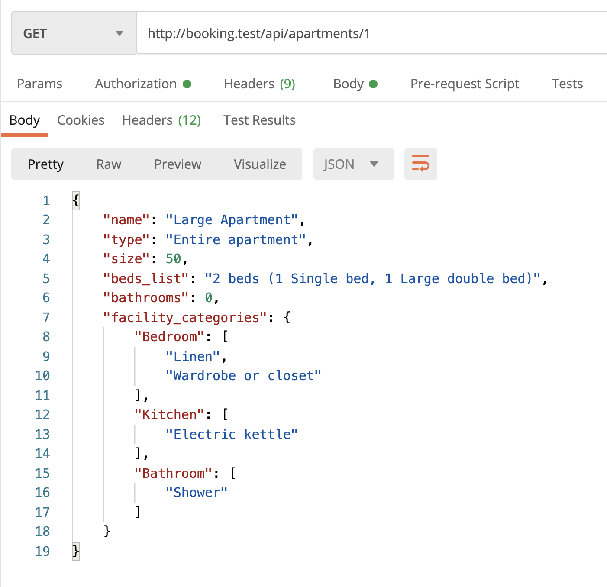
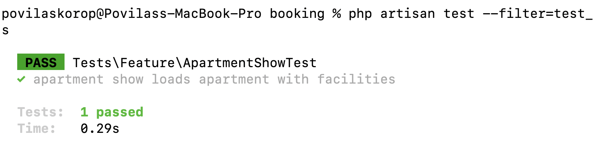

Now, let's move to the detailed view of the specific Apartment which would show facilities grouped by category.

This will be a bit shorter lesson compared to others.

---

## Goals of This Lesson

- New endpoint to Show Apartment
- Grouping the facility data
- PHPUnit test for it

By the end of this lesson, we will have this in Postman:



---

## New Endpoint: Show Apartment

Again, from the previous lesson, here's how the apartment detail facilities screen looks on mobile:


For that, we create a new Controller.

```sh
php artisan make:controller Public/ApartmentController
```

Then we add it to the routes:

**routes/api.php**:
```php
Route::get('search',
    \App\Http\Controllers\Public\PropertySearchController::class);
Route::get('properties/{property}',
    \App\Http\Controllers\Public\PropertyController::class);
Route::get('apartments/{apartment}',
    \App\Http\Controllers\Public\ApartmentController::class);
```

But wait, we have the third public route and Controller, too much repeating code. Time to move those Controller namespaces into the `use` section. Did you know you can do something like this?

**routes/api.php**:
```php
use App\Http\Controllers\Public;

Route::get('search', Public\PropertySearchController::class);
Route::get('properties/{property}', Public\PropertyController::class);
Route::get('apartments/{apartment}', Public\ApartmentController::class);
```

So, do not `use` a specific Controller, but the whole namespace instead. Cool, right?

Now, inside the Controller, we could simply do something like this, reusing the same resource as in search:

```php
namespace App\Http\Controllers\Public;

use App\Http\Controllers\Controller;
use App\Http\Resources\ApartmentSearchResource;
use App\Models\Apartment;

class ApartmentController extends Controller
{
    public function __invoke(Apartment $apartment)
    {
        $apartment->load('facilities.category');

        return new ApartmentSearchResource($apartment);
    }
}
```

But the problem is that we need a **different** structure to be returned, with facilities grouped into categories. So, we generate another API resource - for the same Apartment model, but for a different purpose.

```sh
php artisan make:resource ApartmentDetailsResource
```

**app/Http/Resources/ApartmentDetailsResource.php**:
```php
namespace App\Http\Resources;
class ApartmentDetailsResource extends JsonResource
{
    public function toArray(Request $request): array
    {
        return [
            'name' => $this->name,
            'type' => $this->apartment_type?->name,
            'size' => $this->size,
            'beds_list' => $this->beds_list,
            'bathrooms' => $this->bathrooms,
            'facility_categories' => $this->facility_categories,
        ];
    }
}
```

See the `facility_categories`? How do we populate that? Here's one of the options, using `mapWithKeys()` on the Collection:

```php
namespace App\Http\Controllers\Public;

use App\Http\Controllers\Controller;
use App\Http\Resources\ApartmentDetailsResource;
use App\Models\Apartment;

class ApartmentController extends Controller
{
    public function __invoke(Apartment $apartment)
    {
        $apartment->load('facilities.category');

        $apartment->setAttribute(
            'facility_categories',
            $apartment->facilities->groupBy('category.name')->mapWithKeys(fn ($items, $key) => [$key => $items->pluck('name')])
        );

        return new ApartmentDetailsResource($apartment);
    }
}
```

As you can see, we're minimizing a load of facilities to load only their **names**, as we don't need the full data with IDs, timestamps, and pivot tables.

The visual result:


---

## Automated Test

Now let's create the automated test to check if the facilities are shown correctly.

```sh
php artisan make:test ApartmentShowTest
```

**tests/Feature/ApartmentShowTest.php**:
```php
namespace Tests\Feature;

use App\Models\Apartment;
use App\Models\City;
use App\Models\Facility;
use App\Models\FacilityCategory;
use App\Models\Property;
use App\Models\Role;
use App\Models\User;
use Illuminate\Foundation\Testing\RefreshDatabase;
use Illuminate\Foundation\Testing\WithFaker;
use Tests\TestCase;

class ApartmentShowTest extends TestCase
{
    use RefreshDatabase;

    public function test_apartment_show_loads_apartment_with_facilities()
    {
        $owner = User::factory()->create(['role_id' => Role::ROLE_OWNER]);
        $cityId = City::value('id');
        $property = Property::factory()->create([
            'owner_id' => $owner->id,
            'city_id' => $cityId,
        ]);
        $apartment = Apartment::factory()->create([
            'name' => 'Large apartment',
            'property_id' => $property->id,
            'capacity_adults' => 3,
            'capacity_children' => 2,
        ]);

        $firstCategory = FacilityCategory::create([
            'name' => 'First category'
        ]);
        $secondCategory = FacilityCategory::create([
            'name' => 'Second category'
        ]);
        $firstFacility = Facility::create([
            'category_id' => $firstCategory->id,
            'name' => 'First facility'
        ]);
        $secondFacility = Facility::create([
            'category_id' => $firstCategory->id,
            'name' => 'Second facility'
        ]);
        $thirdFacility = Facility::create([
            'category_id' => $secondCategory->id,
            'name' => 'Third facility'
        ]);
        $apartment->facilities()->attach([
            $firstFacility->id, $secondFacility->id, $thirdFacility->id
        ]);

        $response = $this->getJson('/api/apartments/'.$apartment->id);
        $response->assertStatus(200);
        $response->assertJsonPath('name', $apartment->name);
        $response->assertJsonCount(2, 'facility_categories');

        $expectedFacilityArray = [
            $firstCategory->name => [
                $firstFacility->name,
                $secondFacility->name
            ],
            $secondCategory->name => [
                $thirdFacility->name
            ]
        ];
        $response->assertJsonFragment($expectedFacilityArray, 'facility_categories');
    }
}
```

As you can see, we're building the expected array of specific values and then using `assertJsonFragment()` to check if the `facility_categories` return exactly that.

We're launching the test, and... green!

