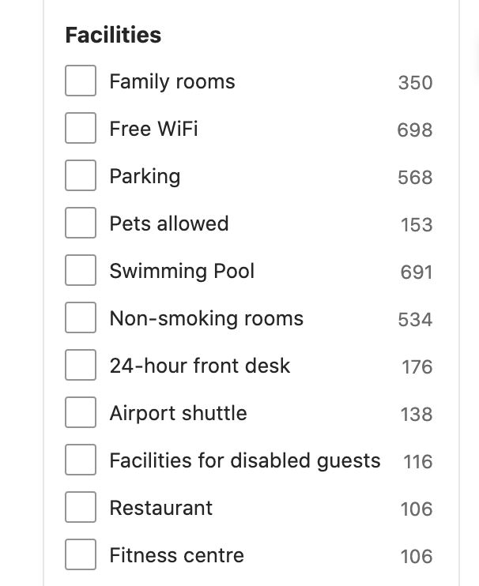
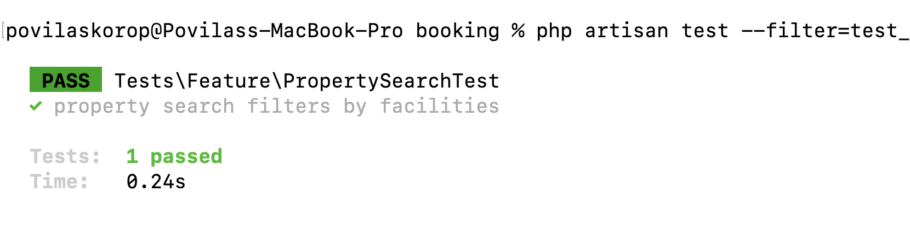
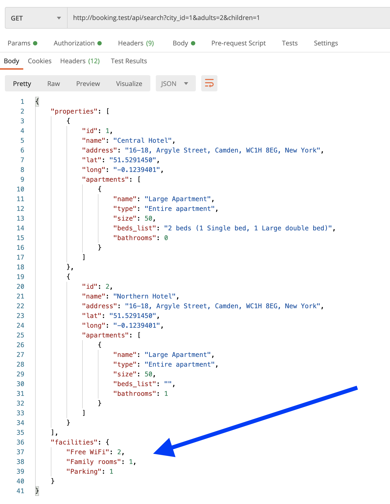
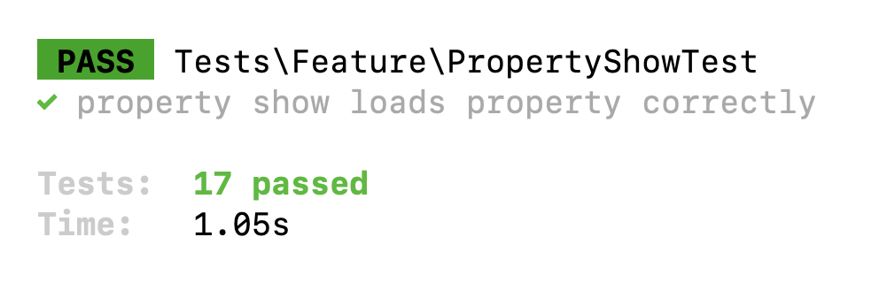

Now we're getting to the facility **filtering**. Imagine you search for a property, you have a list, and then you want to have additional filters: swimming pool, pets allowed, etc.



---

## Goals of This Lesson

- Create a DB Structure for Property Facilities
- Build a list of the most popular facilities - two ways
- Restructure search results to include facilities
- Property filter by facility

By the end of this lesson, we will have this test passing in Terminal:



---

## New "Type": Property Facilities 

Browsing through Booking.com, I realized one more thing: these are all facilities, but they don't belong to the apartments. There are also **property facilities**, more global things like parking, non-smoking areas, etc.

Those are not shown at the apartment level but rather used as a filtering mechanism in the search, which is exactly the topic of the current lesson.

How to structure this in the DB? Here's my brainstorming process:

- __Option 1__: No changes in `facilities`, but just a new pivot table `facility_property`? But then all the facilities will be on the same list for property owners and they wouldn't be able to differentiate when filling in the forms.
- __Option 2__: New record in `facility_categories` with a name like "Property facilities" and then use `where` statements when needed by its name or ID? But hardcoding name or ID didn't feel like the right thing.
- __And then I realized__: we have `facilities.category_id` as a `nullable` field! BINGO! So all such facilities with `category_id = NULL` will be treated as property facilities.

Let's seed a few of them, I will add them into the same already existing seeder.

**database/seeders/FacilitySeeder.php**:
```php
class FacilitySeeder extends Seeder
{
    public function run(): void
    {
        Facility::create(['category_id' => 1, 'name' => 'Linen']);
        // ... other old apartment-type facilities with categories

        // Property facilities:
        Facility::create(['name' => 'Family rooms']);
        Facility::create(['name' => 'Free WiFi']);
        Facility::create(['name' => 'Parking']);
        Facility::create(['name' => 'Pets allowed']);
        Facility::create(['name' => 'Swimming pool']);
    }
}
```

Next, the pivot table I mentioned above.

```sh
php artisan make:migration create_facility_property_table
``` 

**Migration file**:
```php
public function up(): void
{
    Schema::create('facility_property', function (Blueprint $table) {
        $table->foreignId('facility_id')->constrained();
        $table->foreignId('property_id')->constrained();
    });
}
```

Finally, the many-to-many relationships, let's create them both ways.

**app/Models/Property.php**:
```php
class Property extends Model
{
    // ...

    public function facilities()
    {
        return $this->belongsToMany(Facility::class);
    }
}
```

**app/Models/Facility.php**:
```php
class Facility extends Model
{
    // ...

    public function properties()
    {
        return $this->belongsToMany(Property::class);
    }
}
```

Cool, we have the schema. Now, what do we do with it?

---

## Most Popular Facilities List

Those property facilities are not just used for filtering, it's also important how those filters are **presented**. I saw that with the search results, we also need to return **the most popular facilities** among those particular properties found.

Here's how it looks on the left side of the web page:


So, we need to change the return structure of the search results and add facilities to it. This means we also need to change the automated tests to check that "new reality".

This is the updated Controller return structure:

**app/Http/Controllers/Public/PropertySearchController.php**:
```php
class PropertySearchController extends Controller
{
    public function __invoke(Request $request)
    {
        $properties = Property::query()
            // ->with(...)
            // ->when(...)
            // ->when(...)
            // ->when(...)
            ->get();

        $facilities = []; // <- NEXT: HOW DO WE DO THAT?
        // Expected smth like: {"Free WiFi":2,"Family rooms":1,"Parking":1} 

        return [
            'properties' => PropertySearchResource::collection($properties),
            'facilities' => $facilities,
        ];
    }
}
```

The next question becomes, how do we get the most popular facilities of those specific properties? I thought of two ways: with Collections and with Second DB Query. 

Here, I will show you both, it's your personal preference which to use. Technically, we have all the data already in properties, so we can filter them in Collections, but I haven't found a very easily-readable chain of Collection methods to get the same result. So to me personally, it's ok to launch another DB query specifically for facilities.

### Option 1. Filtering with Collections

Here's what the method would look like:

**app/Http/Controllers/Public/PropertySearchController.php**:
```php
public function __invoke(Request $request)
{
    $properties = Property::query()
        ->with([
            'city',
            'apartments.apartment_type',
            'apartments.rooms.beds.bed_type',
            'facilities',
        ])
        // ->when(...)
        // ->when(...)
        // ->when(...)
        ->get();

   $allFacilities = $properties->pluck('facilities')->flatten();
   $facilities = $allFacilities->unique('name')
       ->mapWithKeys(function ($facility) use ($allFacilities) {
           return [$facility->name => $allFacilities->where('name', $facility->name)->count()];
       })
       ->sortDesc();

    return [
        'properties' => PropertySearchResource::collection($properties),
        'facilities' => $facilities,
    ];
}
```

Do you like this chain of `pluck()->flatten()` and then `unique()->mapWithKeys()->sortDesc()`?

To understand it better, you may try to debug it yourself and see what values you have after each method in the chain as I did for many examples in the course [Laravel Collections Chains: 15 Real Examples](https://laraveldaily.com/course/laravel-collections).

But personally, I don't see this as very readable. Or, maybe there's a better way with Collection? Shoot in the comments section, then.

### Option 2. Query DB Using withCount()

Here's another option - a new Eloquent query.

**app/Http/Controllers/Public/PropertySearchController.php**:
```php
public function __invoke(Request $request)
{
    $properties = Property::query()
        ->with([
            'city',
            'apartments.apartment_type',
            'apartments.rooms.beds.bed_type',
            'facilities',
        ])
        // ->when(...)
        // ->when(...)
        // ->when(...)
        ->get();

    $facilities = Facility::query()
        ->withCount(['properties' => function ($property) use ($properties) {
            $property->whereIn('id', $properties->pluck('id'));
        }])
        ->get()
        ->where('properties_count', '>', 0)
        ->sortByDesc('properties_count')
        ->pluck('properties_count', 'name');

    return [
        'properties' => PropertySearchResource::collection($properties),
        'facilities' => $facilities,
    ];
}
```

To me, it feels much more readable. But it's a personal preference. And it's a separate DB query, so if you care about performance more then you may want to go with the Collection option.

Now, I've added some data manually behind the scenes, and if we launch this API endpoint, we have this in Postman:



Great, isn't it?

But not so fast, now our tests are failing. If we launch `php artisan test` for the full suite...


So let's fix that one. We need to go through our tests and add "properties" to the search results structure.

Here are combined examples of changes in multiple methods of the `PropertySearchTest.php` file.

Before:
```php
$response = $this->getJson('/api/search?city=' . $cities[0]);
$response->assertJsonCount(1);
$response->assertJsonCount(1, '0.apartments');
$response->assertJsonPath('0.apartments.0.name', $largeApartment->name);
$response->assertJsonPath('0.apartments.0.beds_list', '...');
```

After:
```php
$response = $this->getJson('/api/search?city=' . $cities[0]);
$response->assertJsonCount(1, 'properties');
$response->assertJsonCount(1, 'properties.0.apartments');
$response->assertJsonPath('properties.0.apartments.0.name', $largeApartment->name);
$response->assertJsonPath('properties.0.apartments.0.beds_list', '...');
```

After doing such changes, we run `php artisan test` again, and... we're back to the green color:



- - - - - - 

## Property Filter by Facility

Now let's use those facilities to actually filter the properties. Our search endpoint will now additionally accept the **array** of facility IDs.

It will be another new `when()` condition in the Controller, quite simple.

**app/Http/Controllers/Public/PropertySearchController.php**:
```php
class PropertySearchController extends Controller
{
    public function __invoke(Request $request)
    {
        $properties = Property::query()
            // ->with(...)
            // ->when(...)
            // ->when(...)
            // ->when(...)
            ->when($request->facilities, function($query) use ($request) {
                $query->whereHas('facilities', function($query) use ($request) {
                    $query->whereIn('facilities.id', $request->facilities);
                });
            })
            ->get();

        return [
            'properties' => PropertySearchResource::collection($properties),
            'facilities' => $facilities,
        ];
    }
}
```

Now we will call the endpoint something like this:
`/api/search?city_id=1&adults=2&children=1&facilities[]=14&facilities[]=15`

Also, let's write an automated test method to ensure that 0/1/2 properties are returned in different cases.

**tests/Feature/PropertySearchTest.php**:
```php
class PropertySearchTest extends TestCase
{
    // ...

    public function test_property_search_filters_by_facilities()
    {
        $owner = User::factory()->create(['role_id' => Role::ROLE_OWNER]);
        $cityId = City::value('id');
        $property = Property::factory()->create([
            'owner_id' => $owner->id,
            'city_id' => $cityId,
        ]);
        Apartment::factory()->create([
            'name' => 'Mid size apartment',
            'property_id' => $property->id,
            'capacity_adults' => 2,
            'capacity_children' => 1,
        ]);
        $property2 = Property::factory()->create([
            'owner_id' => $owner->id,
            'city_id' => $cityId,
        ]);
        Apartment::factory()->create([
            'name' => 'Mid size apartment',
            'property_id' => $property2->id,
            'capacity_adults' => 2,
            'capacity_children' => 1,
        ]);

        // First case - no facilities exist
        $response = $this->getJson('/api/search?city=' . $cityId . '&adults=2&children=1');
        $response->assertStatus(200);
        $response->assertJsonCount(2, 'properties');

        // Second case - filter by facility, 0 properties returned
        $facility = Facility::create(['name' => 'First facility']);
        $response = $this->getJson('/api/search?city=' . $cityId . '&adults=2&children=1&facilities[]=' . $facility->id);
        $response->assertStatus(200);
        $response->assertJsonCount(0, 'properties');

        // Third case - attach facility to property, filter by facility, 1 property returned
        $property->facilities()->attach($facility->id);
        $response = $this->getJson('/api/search?city=' . $cityId . '&adults=2&children=1&facilities[]=' . $facility->id);
        $response->assertStatus(200);
        $response->assertJsonCount(1, 'properties');

        // Fourth case - attach facility to a DIFFERENT property, filter by facility, 2 properties returned
        $property2->facilities()->attach($facility->id);
        $response = $this->getJson('/api/search?city=' . $cityId . '&adults=2&children=1&facilities[]=' . $facility->id);
        $response->assertStatus(200);
        $response->assertJsonCount(2, 'properties');
    }
}
```

And... it works!

