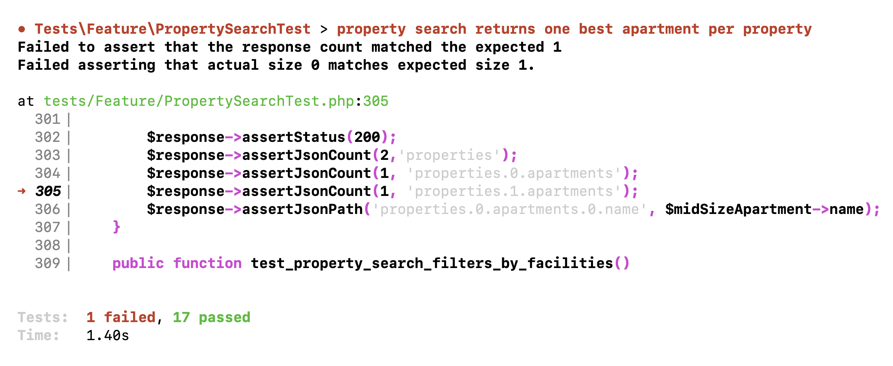

This will be kind of an "offtopic" lesson: I realized I introduced a bug quite a long time ago, and decided to dedicate a full separate lesson about not only how to fix it, but how to properly write tests.

Remember in the property search lesson I realized that we need to return one apartment per property? I fixed it like this, by using `take(1)`. Well, "fixed", I will show you why this approach is incorrect.

**app/Http/Controllers/Public/PropertySearchController.php**:
```php
class PropertySearchController extends Controller
{
    public function __invoke(Request $request)
    {
        $properties = Property::query()
            // ->with(...)
            // ->when(...)
            // ->when(...)
            // ->when(...)
            ->when($request->adults && $request->children, function($query) use ($request) {
                $query->withWhereHas('apartments', function($query) use ($request) {
                    $query->where('capacity_adults', '>=', $request->adults)
                        ->where('capacity_children', '>=', $request->children)
                        ->orderBy('capacity_adults')
                        ->orderBy('capacity_children')
                        ->take(1);
                });
            })
            ->get();
    }
}
```

See that `->take(1)` inside? So yeah, it is limited so that only one apartment per property is returned, and I've tested that it actually worked:

```json
{
    "properties": [
        {
            "id": 1,
            "name": "Central Hotel",
            "address": "16-18, Argyle Street, Camden, WC1H 8EG, New York",
            "lat": "51.5291450",
            "long": "-0.1239401",
            "apartments": [
                {
                    "name": "Large Apartment",
                    "type": "Entire apartment",
                    "size": 50,
                    "beds_list": "2 beds (1 Single bed, 1 Large double bed)",
                    "bathrooms": 0
                }
            ]
        }
    ],
}
```

Only the "Large apartment" is returned, although there are more apartments in that property. Correct, right?

Moreover, I have an automated test method that proves it:

**tests/Feature/PropertySearchTest.php**:
```php
public function test_property_search_returns_one_best_apartment_per_property()
{
    $owner = User::factory()->create(['role_id' => Role::ROLE_OWNER]);
    $cityId = City::value('id');
    $property = Property::factory()->create([
        'owner_id' => $owner->id,
        'city_id' => $cityId,
    ]);
    $largeApartment = Apartment::factory()->create([
        'name' => 'Large apartment',
        'property_id' => $property->id,
        'capacity_adults' => 3,
        'capacity_children' => 2,
    ]);
    $property2 = Property::factory()->create([
        'owner_id' => $owner->id,
        'city_id' => $cityId,
    ]);
    Apartment::factory()->create([
        'name' => 'Large apartment 2',
        'property_id' => $property2->id,
        'capacity_adults' => 3,
        'capacity_children' => 2,
    ]);
    Apartment::factory()->create([
        'name' => 'Mid size apartment 2',
        'property_id' => $property2->id,
        'capacity_adults' => 2,
        'capacity_children' => 1,
    ]);
    Apartment::factory()->create([
        'name' => 'Small apartment 2',
        'property_id' => $property2->id,
        'capacity_adults' => 1,
        'capacity_children' => 0,
    ]);
    $midSizeApartment = Apartment::factory()->create([
        'name' => 'Mid size apartment',
        'property_id' => $property->id,
        'capacity_adults' => 2,
        'capacity_children' => 1,
    ]);
    $smallApartment = Apartment::factory()->create([
        'name' => 'Small apartment',
        'property_id' => $property->id,
        'capacity_adults' => 1,
        'capacity_children' => 0,
    ]);

    $response = $this->getJson('/api/search?city=' . $cityId . '&adults=2&children=1');

    $response->assertStatus(200);
    $response->assertJsonCount(1, 'properties.0.apartments');
    $response->assertJsonPath('properties.0.apartments.0.name', $midSizeApartment->name);
}
```

But what I missed is I didn't test it with **multiple properties returned**.

Then I would have seen that `take(1)` actually means not "one apartment per property" but rather "one apartment in total"! So, if there are multiple properties returned and each of them has apartments, it will NOT return the apartments for the second, third, and other properties:

```json
{
    "properties": [
        {
            "id": 1,
            "name": "Central Hotel",
            "address": "16-18, Argyle Street, Camden, WC1H 8EG, New York",
            "lat": "51.5291450",
            "long": "-0.1239401",
            "apartments": [
                {
                    "name": "Large Apartment",
                    "type": "Entire apartment",
                    "size": 50,
                    "beds_list": "2 beds (1 Single bed, 1 Large double bed)",
                    "bathrooms": 0
                }
            ]
        },
        {
            "id": 2,
            "name": "Northern Hotel",
            "address": "16-18, Argyle Street, Camden, WC1H 8EG, New York",
            "lat": "51.5291450",
            "long": "-0.1239401",
            "apartments": [] // <- BUT WE DO HAVE APARTMENTS HERE IN THE DB!
        }
    ],
}
```

So if, in the test method, I would have created **two** properties... actually, wait, let's do exactly that: add a second property, a few apartments there, and a few new `assert` conditions whether the second property also returns apartments.

**tests/Feature/PropertySearchTest.php**:
```php
public function test_property_search_returns_one_best_apartment_per_property()
{
    $owner = User::factory()->create(['role_id' => Role::ROLE_OWNER]);
    $cityId = City::value('id');
    $property = Property::factory()->create([
        'owner_id' => $owner->id,
        'city_id' => $cityId,
    ]);
    $largeApartment = Apartment::factory()->create([
        'name' => 'Large apartment',
        'property_id' => $property->id,
        'capacity_adults' => 3,
        'capacity_children' => 2,
    ]);
    $property2 = Property::factory()->create([
        'owner_id' => $owner->id,
        'city_id' => $cityId,
    ]);
    Apartment::factory()->create([
        'name' => 'Large apartment 2',
        'property_id' => $property2->id,
        'capacity_adults' => 3,
        'capacity_children' => 2,
    ]);
    Apartment::factory()->create([
        'name' => 'Mid size apartment 2',
        'property_id' => $property2->id,
        'capacity_adults' => 2,
        'capacity_children' => 1,
    ]);
    Apartment::factory()->create([
        'name' => 'Small apartment 2',
        'property_id' => $property2->id,
        'capacity_adults' => 1,
        'capacity_children' => 0,
    ]);
    $midSizeApartment = Apartment::factory()->create([
        'name' => 'Mid size apartment',
        'property_id' => $property->id,
        'capacity_adults' => 2,
        'capacity_children' => 1,
    ]);
    $smallApartment = Apartment::factory()->create([
        'name' => 'Small apartment',
        'property_id' => $property->id,
        'capacity_adults' => 1,
        'capacity_children' => 0,
    ]);

    $property2 = Property::factory()->create([
        'owner_id' => $owner->id,
        'city_id' => $cityId,
    ]);
    Apartment::factory()->create([
        'name' => 'Large apartment 2',
        'property_id' => $property2->id,
        'capacity_adults' => 3,
        'capacity_children' => 2,
    ]);
    Apartment::factory()->create([
        'name' => 'Mid size apartment 2',
        'property_id' => $property2->id,
        'capacity_adults' => 2,
        'capacity_children' => 1,
    ]);
    Apartment::factory()->create([
        'name' => 'Small apartment 2',
        'property_id' => $property2->id,
        'capacity_adults' => 1,
        'capacity_children' => 0,
    ]);

    $response = $this->getJson('/api/search?city=' . $cityId . '&adults=2&children=1');

    $response->assertStatus(200);
    $response->assertJsonCount(2,'properties');
    $response->assertJsonCount(1, 'properties.0.apartments');
    $response->assertJsonCount(1, 'properties.1.apartments');
    $response->assertJsonPath('properties.0.apartments.0.name', $midSizeApartment->name);
}
```

There we go, the test failed!



Quite a "hidden" bug, huh? Now let's fix it. 

**Bad news**: we can't transform this condition in the Eloquent query, because that's how `take()` or `limit()` actually works in Eloquent.

**Good news**: there's a Laravel package that would solve our problem.

Presenting to you the [staudenmeir/eloquent-eager-limit](https://github.com/staudenmeir/eloquent-eager-limit) package!

It does exactly what its name says, quoting from its Readme: "This Laravel Eloquent extension allows limiting the number of eager loading results per parent using window functions."

To use this package, we just need to install it and add its trait `HasEagerLimit` to both [parent/child models of `Property` and `Apartment`.

```sh
composer require staudenmeir/eloquent-eager-limit:"^1.0"
```

**app/Models/Property.php**:
```php
use Staudenmeir\EloquentEagerLimit\HasEagerLimit;

class Property extends Model
{
    use HasFactory;
    use HasEagerLimit;

    // ...
```

**app/Models/Apartment.php**:
```php
use Staudenmeir\EloquentEagerLimit\HasEagerLimit;

class Apartment extends Model
{
    use HasFactory;
    use HasEagerLimit;

    // ...
```

And that's it, we don't need to change **anything** in our Controller or Eloquent query! Brilliant, isn't it?

Result in JSON:

```json
{
    "properties": [
        {
            "id": 1,
            "name": "Central Hotel",
            "address": "16-18, Argyle Street, Camden, WC1H 8EG, New York",
            "lat": "51.5291450",
            "long": "-0.1239401",
            "apartments": [
                {
                    "name": "Large Apartment",
                    "type": "Entire apartment",
                    "size": 50,
                    "beds_list": "2 beds (1 Single bed, 1 Large double bed)",
                    "bathrooms": 0
                }
            ]
        },
        {
            "id": 2,
            "name": "Northern Hotel",
            "address": "16-18, Argyle Street, Camden, WC1H 8EG, New York",
            "lat": "51.5291450",
            "long": "-0.1239401",
            "apartments": [ // <- SEE THE SECOND PROPERTY SHOWS APARTMENTS NOW!
                {
                    "name": "Large Apartment",
                    "type": "Entire apartment",
                    "size": 50,
                    "beds_list": "",
                    "bathrooms": 1
                }
            ]
        }
    ],
    "facilities": {
        "Free WiFi": 2,
        "Family rooms": 1,
        "Parking": 1
    }
}
```

And if we run `php artisan test`, our tests are back to green.

So, as I said, a separate full lesson dedicated to that bug, just to show you a few things:

- If you have automated tests, it doesn't mean you're testing the right scenarios
- Laravel has limitations but has great packages that you can use

Now let's get back on track with building new features in our project, again.