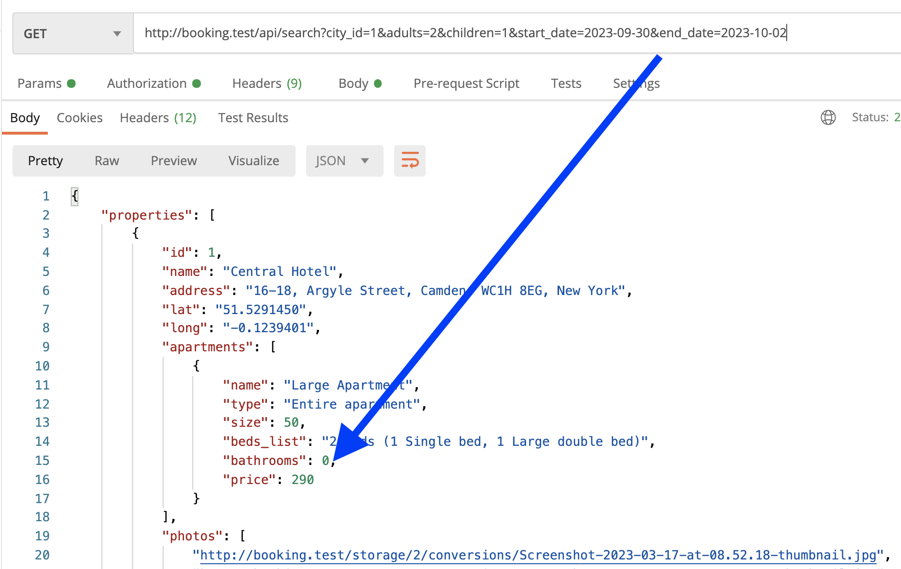
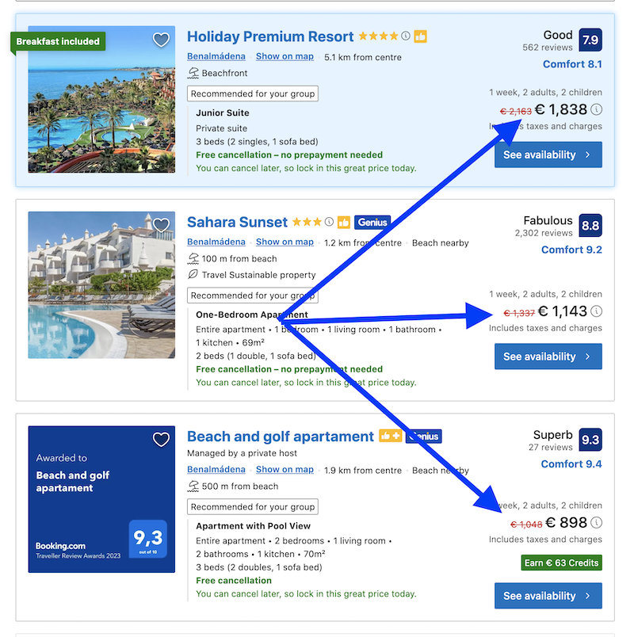
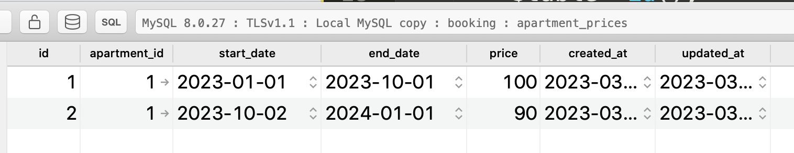
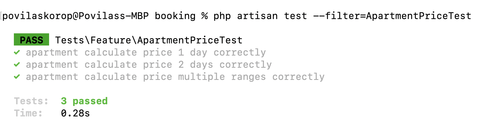
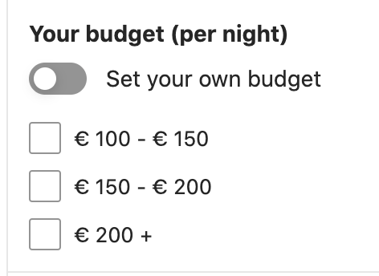

Time to actually start booking properties. But first, how much would they cost? Let's introduce the **pricing** structure. 

To be honest, if we try to implement all possible pricing features from Booking.com, that alone would take weeks to write/read: various "genius levels" for discounts, different prices per guest, etc.

So let's focus on the core functionality: pricing **per calendar days**. Typically, some resorts would cost more in July than in January, so let's work on modeling exactly that.

---

## Goals of This Lesson

- Prices DB structure
- Showing prices in search results
- Filter by price range
- Automated test for pricing

By the end of this lesson, we will have this price calculated and shown in Postman:



---

## Prices DB Structure

We will attach the price not to the property but to the **Apartment** level. The apartment may have many prices, depending on dates, so here's our DB structure for it:

```sh
php artisan make:model ApartmentPrice -m
```

**Migration file**:
```php
public function up(): void
{
    Schema::create('apartment_prices', function (Blueprint $table) {
        $table->id();
        $table->foreignId('apartment_id')->constrained();
        $table->date('start_date');
        $table->date('end_date');
        $table->unsignedInteger('price');
        $table->timestamps();
    });
}
```

For this tutorial, let's simplify that all prices are in dollars/euros/whatever but without cents, so **integer**. At least, I haven't seen cents mentioned anywhere on the pages:



Now, let's make the fields fillable and add dates to the `$casts` so it would be more convenient to work with them as Carbon objects, later.

**app/Models/ApartmentPrice.php**:
```php
class ApartmentPrice extends Model
{
    use HasFactory;

    protected $fillable = ['apartment_id', 'start_date', 'end_date', 'price'];

    protected $casts = [
        'start_date' => 'date',
        'end_date' => 'date',
    ];
}
```

Finally, let's create a relationship in Eloquent Model, and I predict that we will query apartments with prices, so the relationship should be a `hasMany` from the `Apartment` side.

**app/Models/Apartment.php**:
```php
class Apartment extends Model
{
    // ...

    public function prices()
    {
        return $this->hasMany(ApartmentPrice::class);
    }
}
```

If I enter some data in the database, it would look something like this:



---

## Showing Prices in Search Results

The next thing we need to do is to calculate the price of a specific apartment on a specific date interval.

Speaking of which... I just realized our search doesn't have the most important parameters: **WHEN** you want to book a property!

So, in addition to the `city/country/geoobject` and `adults/children`, we will expect two more parameters to the GET request of the `/api/search` endpoint: `start_date` and `end_date`.

Then, our task becomes to show the apartments with total prices for **that** date interval. And this is more complicated than you would think.

Imagine this scenario:

- Apartment costs $100 per day in June and $120 per day in July.
- Someone wants to book a week from June 28 to July 4.
- The price should be 3x100 + 4x120 = $780. That number should be shown in the search result: $780.

So, we need to calculate that "on the fly", depending on the date parameters.

I was thinking for a long time about where to put that method with the logic of calculation. Here's my logic for brainstorming:

1. It's an ApartmentPrice feature so it could be an Accessor on the Model. But accessors don't accept parameters like `start_date` and `end_date`.
2. Could be a method in the Apartment Model? But then how can we make sure to avoid the N+1 query of loading apartments with/without pricing?
3. ... (*head explodes*)

So, after consulting with a few colleagues and playing around, here's the solution I came up with.

In the Controller, to avoid the N+1 query problem, we load the apartments with their prices, but ONLY for the dates that we need.

**app/Http/Controllers/Public/PropertySearchController.php**:
```php
public function __invoke(Request $request)
{
    $properties = Property::query()
        ->with([
            'city',
            'apartments.apartment_type',
            'apartments.rooms.beds.bed_type',
            'apartments.prices' => function($query) use ($request) {
                $query->validForRange([
                    $request->start_date ?? now()->addDay()->toDateString(),
                    $request->end_date ?? now()->addDays(2)->toDateString(),
                ]);
            },
            'facilities',
            'media' => fn($query) => $query->orderBy('position'),
        ])
```

See that `apartments.prices` with a callback function? Let's explore it.

As you can see, I'm passing `$request->start_date` and `$request->end_date` to the function `validForRange()` (*more on that in a minute*), and if those parameters are not present, I default that you want to book for two days starting from tomorrow. This way, we don't need to rewrite old tests (*cause they would break as they don't have/expect those parameters*) and have a fallback value of those parameters.

Next, that `validForRange()` is an Eloquent Scope on the ApartmentPrice model. The reason I used Scope here is because it's quite a big nasty `where()` statement, so to make Controller shorter and more readable, I decided to offload that "beast" to the Eloquent Model.

**app/Models/ApartmentPrice.php**:
```php
class ApartmentPrice extends Model
{
    // ...

    public function scopeValidForRange($query, array $range = [])
    {
        return $query->where(function ($query) use ($range) {
            return $query
                // Covers outer bounds
                ->where(function ($query) use ($range) {
                    $query->where('start_date', '>=', reset($range))->where('end_date', '<=', end($range));
                })
                // Covers left and right bound
                ->orWhere(function ($query) use ($range) {
                    $query->whereBetween('start_date', $range)->orWhereBetween('end_date', $range);
                })
                // Covers inner bounds
                ->orWhere(function ($query) use ($range) {
                    $query->where('start_date', '<=', reset($range))
                        ->where('end_date', '>=', end($range));
                });
        });
    }
}
```

Ok, so we loaded only the prices that we need, avoiding the N+1 query problem. Now, how do we actually calculate the final price?

For that, I decided to go with a custom method (not an accessor) on the Eloquent Model of Apartment. Take a look.

**app/Models/Apartment.php**:
```php
class Apartment extends Model
{
    // ...

    public function prices()
    {
        return $this->hasMany(ApartmentPrice::class);
    }

    public function calculatePriceForDates($startDate, $endDate)
    {
        // Convert to Carbon if not already
        if (!$startDate instanceof Carbon) {
            $startDate = Carbon::parse($startDate)->startOfDay();
        }
        if (!$endDate instanceof Carbon) {
            $endDate = Carbon::parse($endDate)->endOfDay();
        }

        $cost = 0;

        while ($startDate->lte($endDate)) {
            $cost += $this->prices->where(function (ApartmentPrice $price) use ($startDate) {
                return $price->start_date->lte($startDate) && $price->end_date->gte($startDate);
            })->value('price');
            $startDate->addDay();
        }

        return $cost;
    }
}
```

With the help of Carbon features like `->lte()` comparison (remember we used `$casts` above?) and Collection filtering, we can calculate a price by making a loop through the eager-loaded `$this->prices`, adding a price day by day.

It may look complicated, and maybe even inefficient, but that's the solution I came up with: if you want to challenge that with your own variant, shoot in the comments!

Now, how do we actually show that price? We call the method from the API Resource, by adding just one line:

**app/Http/Resources/ApartmentSearchResource.php**:
```php
class ApartmentSearchResource extends JsonResource
{
    public function toArray(Request $request): array
    {
        return [
            'name' => $this->name,
            'type' => $this->apartment_type?->name,
            'size' => $this->size,
            'beds_list' => $this->beds_list,
            'bathrooms' => $this->bathrooms,
            'facilities' => FacilityResource::collection($this->whenLoaded('facilities')),
            'price' => $this->calculatePriceForDates($request->start_date, $request->end_date)
        ];
    }
}
```

Yes, in API Resources `$this` refers to the Model itself, so we can call its methods. 

Here's the result in Postman:


It works!

---

## Automated Test for Pricing

Of course, there are various cases of pricing, and we should test them. So let's get back to our PHPUnit suite and add a few methods there.

We could test it as a feature of search results, but instead, let's test one layer deeper - the method itself. So, we create some records in the DB and check if the calculation method returns the correct result. 

Whether that result is later used in the search or elsewhere, doesn't matter to us. It would be almost like a Unit test instead of a Feature test, but the strict definition of a Unit test would be that it wouldn't touch the database and just work with "inline variables", and I will admit I'm lazy to set that up. So it will be another Feature test, just not calling any endpoints.

```sh
php artisan make:test ApartmentPriceTest
```

**tests/Feature/ApartmentPriceTest.php**:
```php
namespace Tests\Feature;

use App\Models\Apartment;
use App\Models\ApartmentPrice;
use App\Models\City;
use App\Models\Property;
use App\Models\Role;
use App\Models\User;
use Illuminate\Foundation\Testing\RefreshDatabase;
use Illuminate\Foundation\Testing\WithFaker;
use Tests\TestCase;

class ApartmentPriceTest extends TestCase
{
    use RefreshDatabase;

    private function create_apartment(): Apartment
    {
        $owner = User::factory()->create(['role_id' => Role::ROLE_OWNER]);
        $cityId = City::value('id');
        $property = Property::factory()->create([
            'owner_id' => $owner->id,
            'city_id' => $cityId,
        ]);

        return Apartment::create([
            'name' => 'Apartment',
            'property_id' => $property->id,
            'capacity_adults' => 3,
            'capacity_children' => 2,
        ]);
    }

    public function test_apartment_calculate_price_1_day_correctly()
    {
        $apartment = $this->create_apartment();
        ApartmentPrice::create([
            'apartment_id' => $apartment->id,
            'start_date' => now()->toDateString(),
            'end_date' => now()->addDays(10)->toDateString(),
            'price' => 100
        ]);

        $totalPrice = $apartment->calculatePriceForDates(
            now()->toDateString(),
            now()->toDateString()
        );
        $this->assertEquals(100, $totalPrice);
    }

    public function test_apartment_calculate_price_2_days_correctly()
    {
        $apartment = $this->create_apartment();
        ApartmentPrice::create([
            'apartment_id' => $apartment->id,
            'start_date' => now()->toDateString(),
            'end_date' => now()->addDays(10)->toDateString(),
            'price' => 100
        ]);

        $totalPrice = $apartment->calculatePriceForDates(
            now()->toDateString(),
            now()->addDay()->toDateString()
        );
        $this->assertEquals(200, $totalPrice);
    }

    public function test_apartment_calculate_price_multiple_ranges_correctly()
    {
        $apartment = $this->create_apartment();
        ApartmentPrice::create([
            'apartment_id' => $apartment->id,
            'start_date' => now()->toDateString(),
            'end_date' => now()->addDays(2)->toDateString(),
            'price' => 100
        ]);
        ApartmentPrice::create([
            'apartment_id' => $apartment->id,
            'start_date' => now()->addDays(3)->toDateString(),
            'end_date' => now()->addDays(10)->toDateString(),
            'price' => 90
        ]);

        $totalPrice = $apartment->calculatePriceForDates(
            now()->toDateString(),
            now()->addDays(4)->toDateString()
        );
        $this->assertEquals(3*100 + 2*90, $totalPrice);
    }
}
```

As you can see, I'm testing three different scenarios. Also created a separate method `create_apartment()` to avoid repeating code in each method.

The result after `php artisan test` for that specific test file:



Great, we're showing the correct prices in the search results!

---

## Filter by Price Range

Finally, let's filter the properties in the search results by price. Here's how it's done on the Booking.com page itself:



For that, we will add another two `->when()` conditions to the search query, for the min-max range.

**app/Http/Controllers/Public/PropertySearchController.php**:
```php
public function __invoke(Request $request)
{
    $properties = Property::query()
//        ->with(...)
//        ->when(...)
//        ->when(...)
//        ->when(...)
//        ->when(...)
        ->when($request->price_from, function($query) use ($request) {
            $query->whereHas('apartments.prices', function($query) use ($request) {
                $query->where('price', '>=', $request->price_from);
            });
        })
        ->when($request->price_to, function($query) use ($request) {
            $query->whereHas('apartments.prices', function($query) use ($request) {
                $query->where('price', '<=', $request->price_to);
            });
        })
        ->get();
    }
}
```

And that's all we need to do, now we can launch the URL with many parameters, including the filters:

```
/api/search?city_id=1&adults=2&children=1&start_date=2023-09-30&end_date=2023-10-02&price_from=100&price_to=150
```

Let's also write an automated test for it, trying to query various cases.

**tests/Feature/PropertySearchTest.php**:
```php
public function test_property_search_filters_by_price()
{
    $owner = User::factory()->create(['role_id' => Role::ROLE_OWNER]);
    $cityId = City::value('id');
    $property = Property::factory()->create([
        'owner_id' => $owner->id,
        'city_id' => $cityId,
    ]);
    $cheapApartment = Apartment::factory()->create([
        'name' => 'Cheap apartment',
        'property_id' => $property->id,
        'capacity_adults' => 2,
        'capacity_children' => 1,
    ]);
    $cheapApartment->prices()->create([
        'start_date' => now(),
        'end_date' => now()->addMonth(),
        'price' => 70,
    ]);
    $property2 = Property::factory()->create([
        'owner_id' => $owner->id,
        'city_id' => $cityId,
    ]);
    $expensiveApartment = Apartment::factory()->create([
        'name' => 'Mid size apartment',
        'property_id' => $property2->id,
        'capacity_adults' => 2,
        'capacity_children' => 1,
    ]);
    $expensiveApartment->prices()->create([
        'start_date' => now(),
        'end_date' => now()->addMonth(),
        'price' => 130,
    ]);

    // First case - no price range: both returned
    $response = $this->getJson('/api/search?city=' . $cityId . '&adults=2&children=1');
    $response->assertStatus(200);
    $response->assertJsonCount(2, 'properties');

    // First case - min price set: 1 returned
    $response = $this->getJson('/api/search?city=' . $cityId . '&adults=2&children=1&price_from=100');
    $response->assertStatus(200);
    $response->assertJsonCount(1, 'properties');

    // Second case - max price set: 1 returned
    $response = $this->getJson('/api/search?city=' . $cityId . '&adults=2&children=1&price_to=100');
    $response->assertStatus(200);
    $response->assertJsonCount(1, 'properties');

    // Third case - both min and max price set: 2 returned
    $response = $this->getJson('/api/search?city=' . $cityId . '&adults=2&children=1&price_from=50&price_to=150');
    $response->assertStatus(200);
    $response->assertJsonCount(2, 'properties');

    // Fourth case - both min and max price set narrow: 0 returned
    $response = $this->getJson('/api/search?city=' . $cityId . '&adults=2&children=1&price_from=80&price_to=100');
    $response->assertStatus(200);
    $response->assertJsonCount(0, 'properties');
}
```

Launching the test... success!


