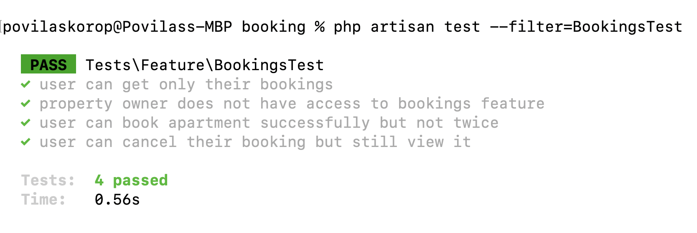
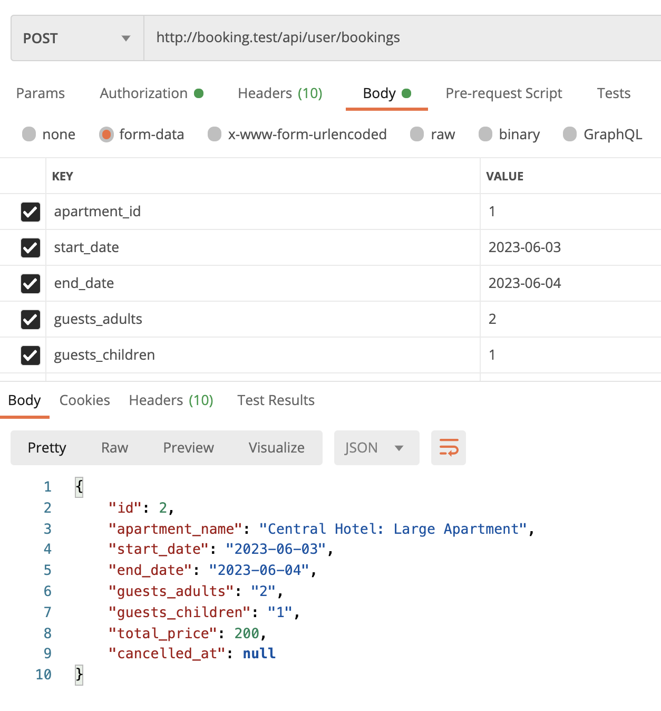
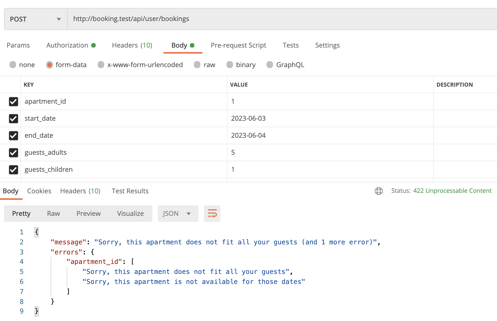
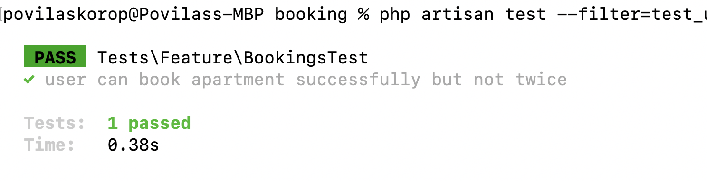
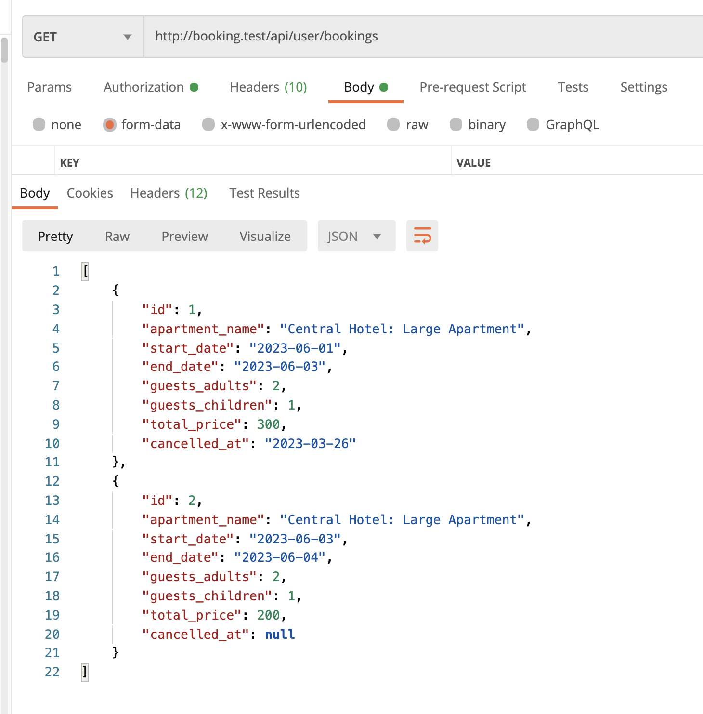

We're finally at the point when we can **make bookings**, yay. 

---

## Goals of This Lesson

- Booking DB Model/Migration
- API endpoint & first successful booking
- Calculating the total price of booking
- Validation: apartment capacity and availability
- Viewing and canceling user's bookings

As usual, covered by tests, so by the end of this lesson, we will have these tests passing:



---

## Booking DB Model/Migration

First, the database structure for that.

```sh
php artisan make:model Booking -m
```

**Migration file**:
```php
Schema::create('bookings', function (Blueprint $table) {
    $table->id();
    $table->foreignId('apartment_id')->constrained();
    $table->foreignId('user_id')->constrained();
    $table->date('start_date');
    $table->date('end_date');
    $table->unsignedInteger('guests_adults');
    $table->unsignedInteger('guests_children');
    $table->unsignedInteger('total_price');
    $table->timestamps();
    $table->softDeletes();
});
```

A few things to notice here:

- Foreign keys for which apartment is booked and which user is booking
- The field `total_price` will be automatically calculated with Observers
- I decided to use Soft Deletes for canceling bookings

We'll get to all of those things later in this lesson. For now, the Model.

**app/Models/Booking.php**:
```php
use Illuminate\Database\Eloquent\SoftDeletes;

class Booking extends Model
{
    use HasFactory, SoftDeletes;

    protected $fillable = [
        'apartment_id',
        'user_id',
        'start_date',
        'end_date',
        'guests_adults',
        'guests_children',
        'total_price'
    ];

    public function apartment()
    {
        return $this->belongsTo(Apartment::class);
    }
}
```

Also, let's create a migration from the User and Apartment models. I have a feeling we will use both.

**app/Models/User.php**:
```php
public function bookings()
{
    return $this->hasMany(Booking::class);
}
```

**app/Models/Apartment.php**:
```php
public function bookings()
{
    return $this->hasMany(Booking::class);
}
```

Next, the Route for the endpoint.

---

## API Endpoint & First Successful Booking

In fact, we already have the `User/BookingController.php`, but we used it only for testing the permissions at the very beginning of the course.

So now, instead of just one `Route::get()`, let's transform it into a proper Resourceful Controller.

**routes/web.php**:
```php
Route::prefix('user')->group(function () {
    Route::resource('bookings', \App\Http\Controllers\User\BookingController::class);
});
```

Next, the `store()` method. But before we fill that in, I suggest we generate two things - a Form Request class, and an API Resource.

```sh
php artisan make:request StoreBookingRequest
php artisan make:resource BookingResource
```

Now, we can use those classes (empty for now) in the Controller:

**app/Http/Controllers/User/BookingController.php**:
```php
use App\Http\Requests\StoreBookingRequest;
use App\Http\Resources\BookingResource;

// ...

public function store(StoreBookingRequest $request)
{
    $booking = auth()->user()->bookings()->create($request->validated());

    return new BookingResource($booking);
}
```

Now, let's fill in the validation FormRequest with the rules.

**app/Http/Requests/StoreBookingRequest.php**:
```php
use Illuminate\Support\Facades\Gate;

class StoreBookingRequest extends FormRequest
{
    public function authorize(): bool
    {
        return Gate::allows('bookings-manage');
    }

    public function rules(): array
    {
        return [
            'apartment_id' => ['required', 'exists:apartments,id'],
            'start_date' => ['required', 'date'],
            'end_date' => ['required', 'date'],
            'guests_adults' => ['integer'],
            'guests_children' => ['integer'],
        ];
    }
}
```

As you can see, in the case of Form Request, we use Gates on that level, instead of checking it in the Controller. It's just my personal preference, no particular reason.

Also, we're checking if the apartment exists.

We will add a few more complicated validation rules a bit later, now let's return our result, which is an object of a new booking.

Here's the structure that I suggest.

**app/Http/Resources/BookingResource.php**:
```php
class BookingResource extends JsonResource
{
    public function toArray(Request $request): array
    {
        return [
            'id' => $this->id,
            'apartment_name' => $this->apartment->property->name . ': ' . $this->apartment->name,
            'start_date' => $this->start_date,
            'end_date' => $this->end_date,
            'guests_adults' => $this->guests_adults,
            'guests_children' => $this->guests_children,
            'total_price' => $this->total_price,
            'cancelled_at' => $this->deleted_at?->toDateString(),
        ];
    }
}
```

And when we launch `POST api/user/bookings` with the correct user's Bearer Token in Postman...



Looks great, it works! Now, look at the screenshot carefully: how is the `total_price` calculated automatically?

---

## Calculating Total Price

For this particular course, we will not cover the payments: that would be a separate HUGE topic with all possible payment service providers. I personally recommend Stripe and Paddle if they are available in your country, also [Laravel Cashier](https://laravel.com/docs/10.x/billing) covers them both really well.

What we will do here is save the total price paid for the booking, automatically from the price.

For that, we generate the Observer:

```sh
php artisan make:observer BookingObserver
```

We register it in the `AppServiceProvider`:

**app/Providers/AppServiceProvider.php**:
```php
use App\Models\Booking;
use App\Observers\BookingObserver;

class AppServiceProvider extends ServiceProvider
{
    public function boot()
    {
        Booking::observe(BookingObserver::class);
    }
}
```

Now, what we would do inside the Observer is call the same method we had created in the lesson earlier.

**app/Observers/BookingObserver.php**:
```php
use App\Models\Booking;

class BookingObserver
{
    public function creating(Booking $booking)
    {
        $booking->total_price = $booking->apartment->calculatePriceForDates(
            $booking->start_date,
            $booking->end_date
        );
    }
}
```

The method `creating()` is different from if we had `created()`. The `creating()` happens **before** data is saved in the DB and allows us to still change the model fields before the saving. This is exactly what we need.

And we do have the method in the `Apartment` model called `calculatePriceForDates()` we had written earlier, right? So it all comes together!

But that's not all. We need to validate a few more things.

---

## Validate Apartment Capacity and Availability

I suggest we add two more validations:

- If `guests_adults/guests_children` still first the apartment capacity
- If someone else hadn't booked the apartment already, while we were browsing around

We can fit those both in a Custom Validation Rule, let's call it `ApartmentAvailableRule`.

```sh
php artisan make:rule ApartmentAvailableRule
```

Then, we use that Rule in our Form Request class array:

**app/Http/Requests/StoreBookingRequest.php**:
```php
use App\Rules\ApartmentAvailableRule;

class StoreBookingRequest extends FormRequest
{
    // ...

    public function rules(): array
    {
        return [
            'apartment_id' => [
                'required', 
                'exists:apartments,id', 
                new ApartmentAvailableRule()
            ],

            // ... other rules
        ];
    }
}
```

Now, what checks we will have inside that Rule class?

Here's the code.

**app/Rules/ApartmentAvailableRule.php**:
```php
namespace App\Rules;

use App\Models\Apartment;
use App\Models\Booking;
use Closure;
use Illuminate\Contracts\Validation\DataAwareRule;
use Illuminate\Contracts\Validation\ValidationRule;

class ApartmentAvailableRule implements ValidationRule, DataAwareRule
{
    protected array $data = [];

    public function validate(string $attribute, mixed $value, Closure $fail): void
    {
        $apartment = Apartment::find($value);
        if (!$apartment) {
            $fail('Sorry, this apartment is not found');
        }
        if ($apartment->capacity_adults < $this->data['guests_adults']
          || $apartment->capacity_children < $this->data['guests_children']) {
            $fail('Sorry, this apartment does not fit all your guests');
        }
        if (Booking::where('apartment_id', $value)
            ->validForRange([$this->data['start_date'], $this->data['end_date']])
            ->exists()) {
            $fail('Sorry, this apartment is not available for those dates');
        }
    }

    public function setData($data)
    {
        $this->data = $data;

        return $this;
    }
}
```

Our parameter to this rule is `$value` which contains the Apartment ID. We need to fetch the apartment and see if its capacity is good.

Also, we need to check the bookings for those dates if there aren't any already.

In all those cases, if something is invalid, we just call `$fail('error message text')`. This is how Laravel 9+ validation rules work.

Also, to access other fields in addition to the `apartment_id`, we use the `$this->data` array. For that to work, we need to add two things:

- Class should implement `DataAwareRule` and add it in the `use` section
- Class should have `$data` property and `setData()` method, exactly as it is written in the example above

Finally, what is this `validForRange()` in the Booking query? You should have seen it somewhere, right?

In one of the previous lessons we created such **scope** for the `ApartmentPrice` model, remember?

```php
class ApartmentPrice extends Model
{
    // ...

    public function scopeValidForRange($query, array $range = [])
    {
        return $query->where(function ($query) use ($range) {
            return $query
                // Covers outer bounds
                ->where(function ($query) use ($range) {
                    $query->where('start_date', '>=', reset($range))->where('end_date', '<=', end($range));
                })
                // Covers left and right bound
                ->orWhere(function ($query) use ($range) {
                    $query->whereBetween('start_date', $range)->orWhereBetween('end_date', $range);
                })
                // Covers inner bounds
                ->orWhere(function ($query) use ($range) {
                    $query->where('start_date', '<=', reset($range))
                        ->where('end_date', '>=', end($range));
                });
        });
    }
}
```

Guess what: now we need the same filter for checking the range of Bookings, too!

So we could repeat the same scope in the second Model by copy-pasting, but such a big snippet of repeating code is not a good practice. To refactor that separately and use the same scope in multiple models, we will move it to a **Trait** and use that Trait in both Models.

So, we create this Trait file manually in the IDE, there's no `php artisan make:trait` command, unfortunately. Also, you can put Traits anywhere you want, I prefer the direct `app/Traits` folder.

**app/Traits/ValidForRange.php**:
```php
namespace App\Traits;

trait ValidForRange {

    public function scopeValidForRange($query, array $range = [])
    {
        return $query->where(function ($query) use ($range) {
            return $query
                // Covers outer bounds
                ->where(function ($query) use ($range) {
                    $query->where('start_date', '>=', reset($range))->where('end_date', '<=', end($range));
                })
                // Covers left and right bound
                ->orWhere(function ($query) use ($range) {
                    $query->whereBetween('start_date', $range)->orWhereBetween('end_date', $range);
                })
                // Covers inner bounds
                ->orWhere(function ($query) use ($range) {
                    $query->where('start_date', '<=', reset($range))
                        ->where('end_date', '>=', end($range));
                });
        });
    }

}
```

And now, we remove that method from the `ApartmentPrice` model, instead adding a Trait, and repeating the same in the `Booking` model.

**app/Models/ApartmentPrice.php**:
```php
use App\Traits\ValidForRange;

class ApartmentPrice extends Model
{
    use HasFactory, ValidForRange;

    // ...
}

```

**app/Models/Booking.php**:
```php
use App\Traits\ValidForRange;

class Booking extends Model
{
    use HasFactory, ValidForRange;

    // ...
}
```

And that's it, now we can use `->validForRange()` on the queries for both of those models.

So yeah, back to validation: seems like I've explained all the parts of the Custom Validation Rule, now let's try to launch the request with invalid data:



Ta-daaa! 

- 422 status code for validation
- The first error message in the `message` field
- All the errors are still available if needed, in the `errors` array


---

## Automated Tests for Successful/Invalid Bookings

Let's cover what we've coded so far, with feature tests. I will just actually paste the code here, pretty sure it will be clear to read, almost as in the English language, so not many comments are needed.

I will add the all-in-one method to the existing `BookingsTest`, also creating a helper method to create an apartment.

**tests/Feature/BookingsTest.php**:
```php
namespace Tests\Feature;

use App\Models\Apartment;
use App\Models\Booking;
use App\Models\City;
use App\Models\Property;
use App\Models\Role;
use App\Models\User;
use Illuminate\Foundation\Testing\RefreshDatabase;
use Tests\TestCase;

class BookingsTest extends TestCase
{
    use RefreshDatabase;

    private function create_apartment(): Apartment
    {
        $owner = User::factory()->create(['role_id' => Role::ROLE_OWNER]);
        $cityId = City::value('id');
        $property = Property::factory()->create([
            'owner_id' => $owner->id,
            'city_id' => $cityId,
        ]);

        return Apartment::create([
            'name' => 'Apartment',
            'property_id' => $property->id,
            'capacity_adults' => 3,
            'capacity_children' => 2,
        ]);
    }

    public function test_user_can_book_apartment_successfully_but_not_twice()
    {
        $user = User::factory()->create(['role_id' => Role::ROLE_USER]);
        $apartment = $this->create_apartment();

        $bookingParameters = [
            'apartment_id' => $apartment->id,
            'start_date' => now()->addDay(),
            'end_date' => now()->addDays(2),
            'guests_adults' => 2,
            'guests_children' => 1,
        ];
        $response = $this->actingAs($user)->postJson('/api/user/bookings', $bookingParameters);
        $response->assertStatus(201);

        $response = $this->actingAs($user)->postJson('/api/user/bookings', $bookingParameters);
        $response->assertStatus(422);

        $bookingParameters['start_date'] = now()->addDays(3);
        $bookingParameters['end_date'] = now()->addDays(4);
        $bookingParameters['guests_adults'] = 5;
        $response = $this->actingAs($user)->postJson('/api/user/bookings', $bookingParameters);
        $response->assertStatus(422);
    }
}
```



---

## Viewing and Canceling Bookings

Here comes the last part of the Bookings CRUD that is actually the easiest one. To view all bookings of the user, we already have a method `index()` just will fill it with the right content.

**app/Http/Controllers/User/BookingController.php**:
```php
class BookingController extends Controller
{
    public function index()
    {
        $this->authorize('bookings-manage');

        $bookings = auth()->user()->bookings()
            ->with('apartment.property')
            ->withTrashed()
            ->orderBy('start_date')
            ->get();

        return BookingResource::collection($bookings);
    }

    // ...
}
```

Needs any explanation? I don't think so. The only thing worth mentioning probably is `withTrashed()` because users want to still see their canceled bookings, too.

The result in Postman:



Next, for showing and canceling the booking the code is also very simple, almost identical. 

**app/Http/Controllers/User/BookingController.php**:
```php
class BookingController extends Controller
{
    // ...

    public function show(Booking $booking)
    {
        $this->authorize('bookings-manage');

        if ($booking->user_id != auth()->id()) {
            abort(403);
        }

        return new BookingResource($booking);
    }

    public function destroy(Booking $booking)
    {
        $this->authorize('bookings-manage');

        if ($booking->user_id != auth()->id()) {
            abort(403);
        }

        $booking->delete();

        return response()->noContent();
    }
}
```

Some things to explain:

- We're using Route Model Binding with the `Booking $booking` parameter, but we still need to check if the booking's user is the same as the logged-in one, otherwise we `abort(403)` as forbidden
- In case of deleting, we use that method for canceling, and we don't have anything to return as the result, so `noContent()` would automatically return the 204 status code

Finally, automated tests for all of the above:

**tests/Feature/BookingsTest.php**:
```php
namespace Tests\Feature;

class BookingsTest extends TestCase
{
    public function test_user_can_get_only_their_bookings()
    {
        $user1 = User::factory()->create(['role_id' => Role::ROLE_USER]);
        $user2 = User::factory()->create(['role_id' => Role::ROLE_USER]);
        $apartment = $this->create_apartment();
        $booking1 = Booking::create([
            'apartment_id' => $apartment->id,
            'user_id' => $user1->id,
            'start_date' => now()->addDay(),
            'end_date' => now()->addDays(2),
            'guests_adults' => 1,
            'guests_children' => 0,
        ]);
        $booking2 = Booking::create([
            'apartment_id' => $apartment->id,
            'user_id' => $user2->id,
            'start_date' => now()->addDay(3),
            'end_date' => now()->addDays(4),
            'guests_adults' => 2,
            'guests_children' => 1,
        ]);

        $response = $this->actingAs($user1)->getJson('/api/user/bookings');
        $response->assertStatus(200);
        $response->assertJsonCount(1);
        $response->assertJsonFragment(['guests_adults' => 1]);

        $response = $this->actingAs($user1)->getJson('/api/user/bookings/' . $booking1->id);
        $response->assertStatus(200);
        $response->assertJsonFragment(['guests_adults' => 1]);

        $response = $this->actingAs($user1)->getJson('/api/user/bookings/' . $booking2->id);
        $response->assertStatus(403);
    }

    public function test_user_can_cancel_their_booking_but_still_view_it()
    {
        $user1 = User::factory()->create(['role_id' => Role::ROLE_USER]);
        $user2 = User::factory()->create(['role_id' => Role::ROLE_USER]);
        $apartment = $this->create_apartment();
        $booking = Booking::create([
            'apartment_id' => $apartment->id,
            'user_id' => $user1->id,
            'start_date' => now()->addDay(),
            'end_date' => now()->addDays(2),
            'guests_adults' => 1,
            'guests_children' => 0,
        ]);

        $response = $this->actingAs($user2)->deleteJson('/api/user/bookings/' . $booking->id);
        $response->assertStatus(403);

        $response = $this->actingAs($user1)->deleteJson('/api/user/bookings/' . $booking->id);
        $response->assertStatus(204);

        $response = $this->actingAs($user1)->getJson('/api/user/bookings');
        $response->assertStatus(200);
        $response->assertJsonCount(1);
        $response->assertJsonFragment(['cancelled_at' => now()->toDateString()]);

        $response = $this->actingAs($user1)->getJson('/api/user/bookings/' . $booking->id);
        $response->assertStatus(200);
        $response->assertJsonFragment(['cancelled_at' => now()->toDateString()]);
    }
}
```

So two methods, that are both self-explanatory, in my opinion, we're testing all the scenarios I mentioned before, including these:

- Users can view/manage only **their** bookings
- Users can cancel bookings but still see them in the list

The result for all the tests:


And that's it for managing the bookings. Of course, the real Booking.com version has much more functionality, but I will leave the rest for you as "homework" depending on your free time available for further experiments.