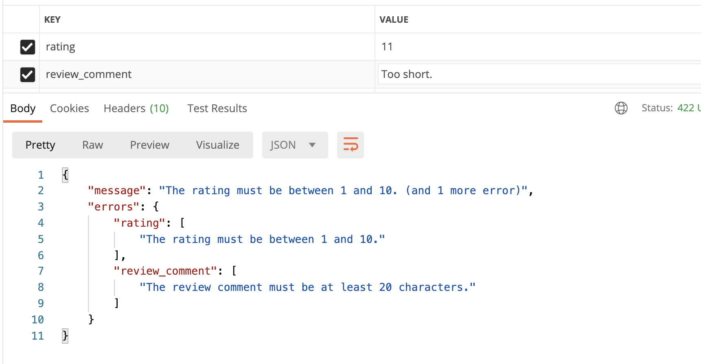
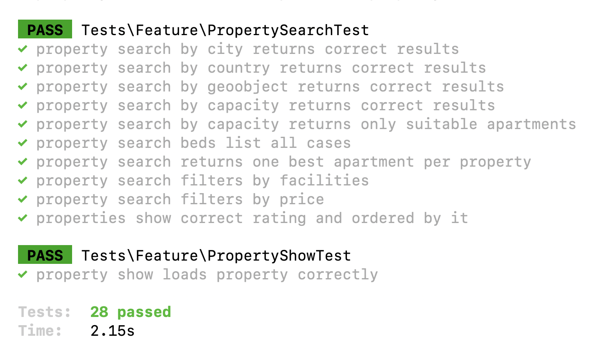

Time for us to talk about **rating** of the apartments. After their stay, users are asked to rate the property. 

---

## Goals of This Lesson

- Rating DB structure
- Endpoint for saving the ratings and reviews
- Show ratings in the search results
- Order search results by ratings

By the end of this lesson, we will have this in Postman - see the last two fields returned:


---

## Ratings DB Schema

While browsing Booking.com, I found out that only one main number of the user's ratings is actually calculated in the average of the property. Users are asked to rate separately many more features - cleanliness, friendly staff, etc - but we will not implement that. We will simplify it into this:

- Every booking may have a rating (1-10) and a text-form review comment
- This rating is attached to the booking for the **apartment**, but in the search result we need to calculate the average for all the apartments of the **property**

So, step by step.

At first, I thought to save the ratings separately, but in reality, we need just two new columns in the same DB table.

```sh
php artisan make:migration add_rating_fields_to_bookings_table
```

**Migration file**:
```php
public function up(): void
{
    Schema::table('bookings', function (Blueprint $table) {
        $table->unsignedInteger('rating')->nullable();
        $table->text('review_comment')->nullable();
    });
}
```

Also, we make those fields fillable in the model.

**app/Models/Booking.php**:
```php
class Booking extends Model
{
    protected $fillable = [
        'apartment_id',
        'user_id',
        'start_date',
        'end_date',
        'guests_adults',
        'guests_children',
        'total_price',
        'rating',
        'review_comment',
    ];

    // ...
```

---

## Post Rating: Update Booking?

While thinking about what method to create for posting the rating, I realized it's actually updating the booking, just with two specific fields of `rating` and `review_comment`.

In general, I quite like the philosophy called "CRUDdy By Design" by Adam Wathan, which means that the majority of actions should be one of 7 typical Resource Controller methods: index/create/store/edit/update/destroy.

So, in our case, we will just add a method to the `BookingController`. We already have this Controller under `Route::resource()`, so we don't need to change anything in the Routes.

For validation, we do generate a separate Form Request class.

```sh
php artisan make:request UpdateBookingRequest
```

Then, in Controller, all we do is this:

**app/Http/Controllers/User/BookingController.php**:
```php
use App\Http\Requests\UpdateBookingRequest;

// ...

public function update(Booking $booking, UpdateBookingRequest $request)
{
    if ($booking->user_id != auth()->id()) {
        abort(403);
    }

    $booking->update($request->validated());

    return new BookingResource($booking);
}
```

In the Form Request, we add both fields as optional but with certain validation rules:

**app/Http/Requests/UpdateBookingRequest.php**:
```php
use Illuminate\Support\Facades\Gate;

class UpdateBookingRequest extends FormRequest
{
    public function authorize(): bool
    {
        return Gate::allows('bookings-manage');
    }

    public function rules(): array
    {
        return [
            'rating' => 'integer|between:1,10',
            'review_comment' => 'min:20',
        ];
    }
}
```

**Important notice**: if you use just the "between" validation rule without "integer", it will incorrectly validate the **size** of the number as a string, and not the number itself. Don't ask me how I found out :)

Finally, let's add those fields to the `BookingResource` to be returned.

**app/Http/Resources/BookingResource.php**:
```php
public function toArray(Request $request): array
{
    return [
        // ... other fields

        'rating' => $this->rating,
        'review_comment' => $this->review_comment,
    ];
}
```

So now, if we make an update request in Postman... we see this:


And in case of validation error...



And we add an automated test for this feature, as a new method in BookingsTest.

**tests/Feature/BookingsTest.php**:
```php
public function test_user_can_post_rating_for_their_booking()
{
    $user1 = User::factory()->create(['role_id' => Role::ROLE_USER]);
    $user2 = User::factory()->create(['role_id' => Role::ROLE_USER]);
    $apartment = $this->create_apartment();
    $booking = Booking::create([
        'apartment_id' => $apartment->id,
        'user_id' => $user1->id,
        'start_date' => now()->addDay(),
        'end_date' => now()->addDays(2),
        'guests_adults' => 1,
        'guests_children' => 0,
    ]);

    $response = $this->actingAs($user2)->putJson('/api/user/bookings/' . $booking->id, []);
    $response->assertStatus(403);

    $response = $this->actingAs($user1)->putJson('/api/user/bookings/' . $booking->id, [
        'rating' => 11
    ]);
    $response->assertStatus(422);

    $response = $this->actingAs($user1)->putJson('/api/user/bookings/' . $booking->id, [
        'rating' => 10,
        'review_comment' => 'Too short comment.'
    ]);
    $response->assertStatus(422);

    $correctData = [
        'rating' => 10,
        'review_comment' => 'Comment with a good length to be accepted.'
    ];
    $response = $this->actingAs($user1)->putJson('/api/user/bookings/' . $booking->id, $correctData);
    $response->assertStatus(200);
    $response->assertJsonFragment($correctData);
}
```

---

## Search Results: Property Average Rating

What do we do with those ratings? Of course, we need to show them in the search results, and also order by them, showing top-rated properties on top.

The tricky part is that we need to show the average rating of a **property**, calculating the average of all ratings of all its apartments.

Luckily, Laravel allows us to perform it quite easily, using the `withAvg()` method.

First, we create a `hasManyThrough` relationship from Property directly to Booking:

**app/Models/Property.php**:
```php
public function bookings()
{
    return $this->hasManyThrough(Booking::class, Apartment::class);
}
```

And then we can use that `bookings()` method as a part of the `withAvg()` function.

Not only that, we can immediately order by that average rating!

**app/Http/Controllers/Public/PropertySearchController.php**:
```php
public function __invoke(Request $request)
{
    $properties = Property::query()
        ->with([
            'city',
            // ... other relationships
        ])
        ->withAvg('bookings', 'rating')
        // ... ->when()
        // ... ->when()
        // ... ->when()
        // ... ->when()
        ->orderBy('bookings_avg_rating', 'desc')
        ->get();

    // ...
}
```

That `withAvg()` function returns the field called `bookings_avg_rating`. Let's transform it into a bit shorter one, in the API Resource: 

**app/Http/Resources/PropertySearchResource.php**:
```php
class PropertySearchResource extends JsonResource
{
    public function toArray(Request $request): array
    {
        return [
            'id' => $this->id,
            // ...

            'avg_rating' => $this->bookings_avg_rating,
        ];
    }
}
```

The result in Postman won't fit on the screen but trust me, it works. 

As proof, here's the automated test for this, added to the PropertySearchTest.

**tests/Feature/PropertySearchTest.php**:
```php
public function test_properties_show_correct_rating_and_ordered_by_it()
{
    $owner = User::factory()->create(['role_id' => Role::ROLE_OWNER]);
    $cityId = City::value('id');
    $property = Property::factory()->create([
        'owner_id' => $owner->id,
        'city_id' => $cityId,
    ]);
    $apartment1 = Apartment::factory()->create([
        'name' => 'Cheap apartment',
        'property_id' => $property->id,
        'capacity_adults' => 2,
        'capacity_children' => 1,
    ]);
    $property2 = Property::factory()->create([
        'owner_id' => $owner->id,
        'city_id' => $cityId,
    ]);
    $apartment2 = Apartment::factory()->create([
        'name' => 'Mid size apartment',
        'property_id' => $property2->id,
        'capacity_adults' => 2,
        'capacity_children' => 1,
    ]);
    $user1 = User::factory()->create(['role_id' => Role::ROLE_USER]);
    $user2 = User::factory()->create(['role_id' => Role::ROLE_USER]);
    Booking::create([
        'apartment_id' => $apartment1->id,
        'user_id' => $user1->id,
        'start_date' => now()->addDay(),
        'end_date' => now()->addDays(2),
        'guests_adults' => 1,
        'guests_children' => 0,
        'rating' => 7
    ]);
    Booking::create([
        'apartment_id' => $apartment2->id,
        'user_id' => $user1->id,
        'start_date' => now()->addDay(),
        'end_date' => now()->addDays(2),
        'guests_adults' => 1,
        'guests_children' => 0,
        'rating' => 9
    ]);
    Booking::create([
        'apartment_id' => $apartment2->id,
        'user_id' => $user2->id,
        'start_date' => now()->addDay(),
        'end_date' => now()->addDays(2),
        'guests_adults' => 1,
        'guests_children' => 0,
        'rating' => 7
    ]);

    $response = $this->getJson('/api/search?city=' . $cityId . '&adults=2&children=1');
    $response->assertStatus(200);
    $response->assertJsonCount(2, 'properties');
    $this->assertEquals(8, $response->json('properties')[0]['avg_rating']);
    $this->assertEquals(7, $response->json('properties')[1]['avg_rating']);
}
```

Let's launch our full test suite... It works including the ratings now!



Reminder: you can check all the code in [this GitHub repository](https://github.com/LaravelDaily/Booking-Com-Simulation-Laravel).