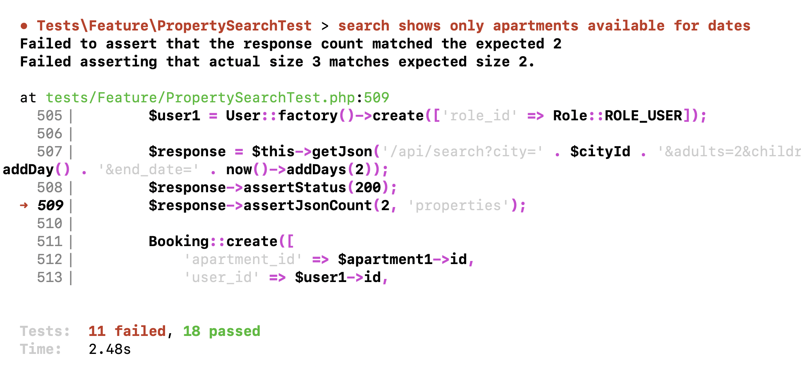
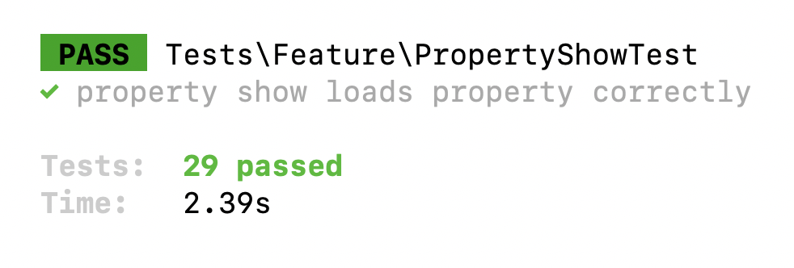

Until now, we've been working with pretty "ideal" scenario of just a few properties and apartments available. Time to simulate much more serious project and optimize the performance of our queries and endpoints.

First, in this lesson, let's introduce the **pagination** to our search results. And this will be a bit more complex than you would think.

---

## "Just" Change get() To paginate()?

Our current code in the Search Controller:

**app/Http/Controllers/Public/PropertySearchController.php**:
```php
public function __invoke(Request $request)
{
    $properties = Property::query()
        // ->with(...)
        // ->when(...)
        ->orderBy('bookings_avg_rating', 'desc')
        ->get(); // <-- NO PAGINATION HERE, YET

    $facilities = Facility::query()
        ->withCount(['properties' => function ($property) use ($properties) {
            // THIS LINE IS IMPORTANT: WE'RE USING $properties
            $property->whereIn('id', $properties->pluck('id'));
        }])
        ->get()
        ->where('properties_count', '>', 0)
        ->sortByDesc('properties_count')
        ->pluck('properties_count', 'name');

    return [
        'properties' => PropertySearchResource::collection($properties),
        'facilities' => $facilities,
    ];
}
```

Technically, we could just change `->get()` to `->paginate(10)` in the main query, and Laravel would auto-apply the pagination. But we have two problems in this case:

1. We still also need IDs of **all** properties, to be used while querying the top popular **facilities** in the second part of Controller method.
2. Laravel would add `data` layer for the pagination, which means we would need to re-write all our automated tests which expect a different structure of results.

I will say right away that we would need to edit the tests anyway, that part is unavoidable, we'll get to it a bit later in this lesson.

For now, let's focus on the dilemma: **how can we return the paginated records but still get IDs of ALL records**.

There are various solutions to this, but what I came up with is this:

- We don't call `->get()` immediately in the Query
- We take `pluck('id')` from the DB and not the Collection
- Then separately we call `paginate()` when we return the result.
- We also rename the variable from `$properties` to `$propertiesQuery` for clarity and readability

Let me demonstrate in the code:

**app/Http/Controllers/Public/PropertySearchController.php**:
```php
public function __invoke(Request $request)
{
    $propertiesQuery = Property::query()
        // ->with(...)
        // ->when(...)
        ->orderBy('bookings_avg_rating', 'desc');
        // WE'RE NOT CALLING get() HERE ANYMORE

    $facilities = Facility::query()
        ->withCount(['properties' => function ($property) use ($propertiesQuery) {
            // THIS ->pluck() NOW GETS IDs DIRECTLY FROM DB
            $property->whereIn('id', $propertiesQuery->pluck('id'));
        }])
        ->get()
        ->where('properties_count', '>', 0)
        ->sortByDesc('properties_count')
        ->pluck('properties_count', 'name');

    // WE ADD ->paginate(10) HERE INSTEAD
    $properties = $propertiesQuery->paginate(10)->withQueryString();

    return [
        'properties' => PropertySearchResource::collection($properties),
        'facilities' => $facilities,
    ];
}
```

As a result, we will get only 10 properties instead of all hundreds/thousands of them from the database. I've seeded some fake properties, and here's the result. 

```json
{
    "properties": [
        {
            "id": 201,
            "name": "Impedit ea soluta.",
            // ...
        },
        {
            "id": 390,
            "name": "Nesciunt id eos.",
            // ...
        },
        {
            "id": 910,
            "name": "Ad nesciunt cum.",
            // ...
        },
        {
            "id": 518,
            "name": "Qui ut nisi nisi.",
            // ...
        },
        {
            "id": 58,
            "name": "Unde laboriosam.",
            // ...
        },
        {
            "id": 749,
            "name": "Deserunt id quis.",
            // ...
        },
        {
            "id": 680,
            "name": "Sunt cupiditate.",
            // ...
        },
        {
            "id": 1389,
            "name": "Quia iure voluptas.",
            // ...
        },
        {
            "id": 661,
            "name": "Doloremque nobis.",
            // ...
        },
        {
            "id": 396,
            "name": "Cumque nobis.",
            // ...
        }
    ],
    "facilities": []
}
```

---

## Pagination Doesn't Return Links?

So we did introduce pagination, good. However, there's a problem. 

The default [Eloquent API Resources Pagination](https://laravel.com/docs/10.x/eloquent-resources#pagination) with `->paginate()` should automatically return the links to the next pages, as well as the structure of total records and more, here's the example structure from the docs:

```json
{
    "data": [
        {
            "id": 1,
            "name": "Eladio Schroeder Sr.",
            "email": "therese28@example.com"
        },
        {
            "id": 2,
            "name": "Liliana Mayert",
            "email": "evandervort@example.com"
        }
    ],
    "links":{
        "first": "http://example.com/users?page=1",
        "last": "http://example.com/users?page=1",
        "prev": null,
        "next": null
    },
    "meta":{
        "current_page": 1,
        "from": 1,
        "last_page": 1,
        "path": "http://example.com/users",
        "per_page": 15,
        "to": 10,
        "total": 10
    }
}
```

In our case, it doesn't automatically do it. Why? 

The reason is that we also return `facilities` from the same endpoint, so Laravel doesn't automatically recognize that the properties structure should be transformed into a "JSON with paginated structure".

In other words, by returning two things from the same endpoint, we kinda "shot ourselves in the foot" because automatic pagination doesn't work anymore. But we **do** need those facilities returned, it wouldn't make much sense to create a separate endpoint and duplicate the same heavy search query there.

Luckily, there is a solution. We can "force" Laravel to return the paginated data: it actually exists within the results, just isn't automatically shown to us.

I've found [this solution on Laracasts forum](https://laracasts.com/discuss/channels/laravel/paginate-while-returning-array-of-api-resource-objects-to-the-resource-collection?page=1&replyId=575401) - adding `->response()->getData(true)` feels a bit "hacky" manipulation of data, but hey, it works!

**app/Http/Controllers/Public/PropertySearchController.php**:
```php
public function __invoke(Request $request)
{
    // ...

    $properties = $propertiesQuery->paginate(10)->withQueryString();

    return [
        'properties' => PropertySearchResource::collection($properties)
            ->response()
            ->getData(true),
        'facilities' => $facilities,
    ];
}
```

Now look at the result of the same endpoint, it added the `data` along with the pagination information, as we wanted:

```json
{
    "properties": {
        "data": [
            {
                "id": 201,
                "name": "Impedit ea soluta.",
                // ...
            },
            {
                "id": 390,
                "name": "Nesciunt id eos.",
                // ...
            },
            {
                "id": 910,
                "name": "Ad nesciunt cum.",
                // ...
            },
            {
                "id": 518,
                "name": "Qui ut nisi nisi.",
                // ...
            },
            {
                "id": 58,
                "name": "Unde laboriosam.",
                // ...
            },
            {
                "id": 749,
                "name": "Deserunt id quis.",
                // ...
            },
            {
                "id": 680,
                "name": "Sunt cupiditate.",
                // ...
            },
            {
                "id": 1389,
                "name": "Quia iure voluptas.",
                // ...
            },
            {
                "id": 661,
                "name": "Doloremque nobis.",
                // ...
            },
            {
                "id": 396,
                "name": "Cumque nobis.",
                // ...
            }
        ],
        "links": {
            "first": "http://booking.test/api/search?city_id=1&adults=2&children=1&start_date=2023-03-01&end_date=2023-03-04&page=1",
            "last": "http://booking.test/api/search?city_id=1&adults=2&children=1&start_date=2023-03-01&end_date=2023-03-04&page=798",
            "prev": null,
            "next": "http://booking.test/api/search?city_id=1&adults=2&children=1&start_date=2023-03-01&end_date=2023-03-04&page=2"
        },
        "meta": {
            "current_page": 1,
            "from": 1,
            "last_page": 798,
            "links": [
                {
                    "url": null,
                    "label": "&laquo; Previous",
                    "active": false
                },
                {
                    "url": "http://booking.test/api/search?city_id=1&adults=2&children=1&start_date=2023-03-01&end_date=2023-03-04&page=1",
                    "label": "1",
                    "active": true
                },
                {
                    "url": "http://booking.test/api/search?city_id=1&adults=2&children=1&start_date=2023-03-01&end_date=2023-03-04&page=2",
                    "label": "2",
                    "active": false
                },
                // ...
                {
                    "url": null,
                    "label": "...",
                    "active": false
                },
                {
                    "url": "http://booking.test/api/search?city_id=1&adults=2&children=1&start_date=2023-03-01&end_date=2023-03-04&page=798",
                    "label": "798",
                    "active": false
                },
                {
                    "url": "http://booking.test/api/search?city_id=1&adults=2&children=1&start_date=2023-03-01&end_date=2023-03-04&page=2",
                    "label": "Next &raquo;",
                    "active": false
                }
            ],
            "path": "http://booking.test/api/search",
            "per_page": 10,
            "to": 10,
            "total": 7978
        }
    },
    "facilities": []
}
```

---

## Fixing Tests

Finally, we need to fix the issue I had already mentioned above.

If we run `php artisan test` now... **11 failed tests**:



That's because we introduced `properties -> data` into our structure, and tests don't know about that. Here's the list of changes we need to make everywhere in the `PropertySearchTest` file:

- Change `$response->assertJsonCount($number, 'properties');` to `$response->assertJsonCount($number, 'properties.data');`
- Change `$response->assertJsonCount($number, 'properties.0.whatever');` to `$response->assertJsonCount($number, 'properties.data.0.whatever');`
- Change `$response->json('properties')[0]` to `$response->json('properties.data')[0]`

Examples:

```php
-        $response->assertJsonCount(1, 'properties');
+        $response->assertJsonCount(1, 'properties.data');

// ...

-        $response->assertJsonCount(1, 'properties');
-        $response->assertJsonCount(1, 'properties.0.apartments');
-        $response->assertJsonPath('properties.0.apartments.0.name', $largeApartment->name);
+        $response->assertJsonCount(1, 'properties.data');
+        $response->assertJsonCount(1, 'properties.data.0.apartments');
+        $response->assertJsonPath('properties.data.0.apartments.0.name', $largeApartment->name);

-        $this->assertEquals(8, $response->json('properties')[0]['avg_rating']);
-        $this->assertEquals(7, $response->json('properties')[1]['avg_rating']);
+        $response->assertJsonCount(2, 'properties.data');
+        $this->assertEquals(8, $response->json('properties.data')[0]['avg_rating']);
```

And now we have tests green again!



**Notice**: keep in mind that here we made a crucial breaking change in our API, we changed the structure we return. You can make such drastical changes only when the project is not live and not consumed by any API client(s). If the project is already up and running, such change would force all the clients to change their code, and/or you would need to introduce a new version for your API, while the old version still keeps running.