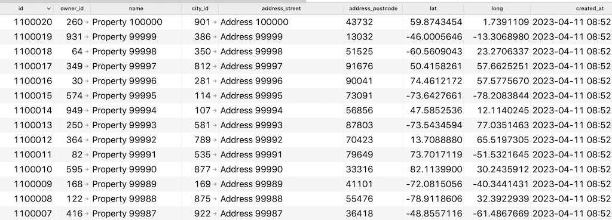
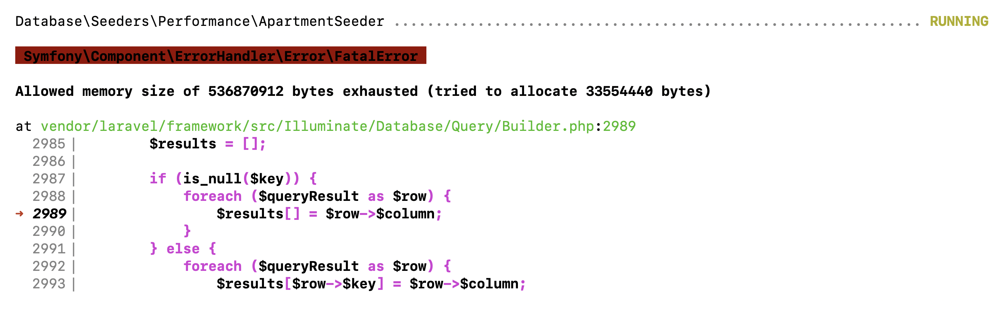
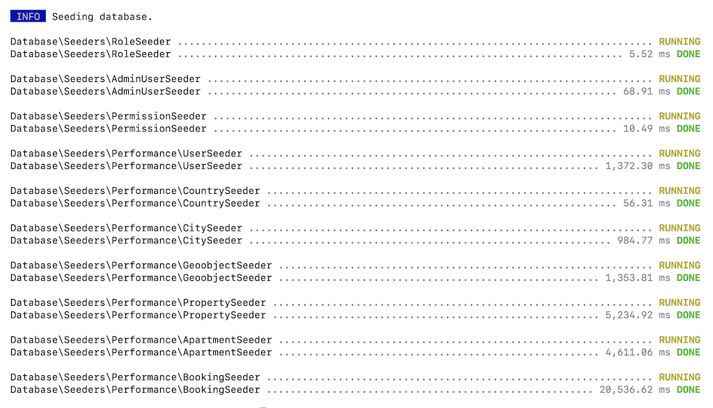

After we introduced pagination in the last lesson, we shouldn't have performance problems with loading too much data. But what about Eloquent queries in the search? Time to test their loading time.

For that, first, we need to simulate a significant amount of data, in factories/seeders.

---

## Simulating Data with Seeders/Factories

I will go for this scenario to seed:

- 100 countries
- 1000 cities
- 1000 geoobjects
- 1000 owners and 1000 regular users
- 100 000 properties
- 200 000 apartments
- 200 000 bookings with ratings and 200 000 bookings without ratings

To implement that testing scenario, I decided to create a totally **separate** Seeder class, that could be launched on a separate testing DB, for example.

So you would run:

```sh
php artisan migrate:fresh
php artisan db:seed --class=PerformanceTestingSeeder
```

Also, I created a set of separate seeders in their own subfolder, specifically called within that `PerformanceTestingSeeder`, and not within the main `DatabaseSeeder`:

```sh 
php artisan make:seeder Performance/CountrySeeder
php artisan make:seeder Performance/CitySeeder
php artisan make:seeder Performance/GeoobjectSeeder
php artisan make:seeder Performance/PropertySeeder
php artisan make:seeder Performance/ApartmentSeeder
php artisan make:seeder Performance/BookingSeeder
```

Then, in the PerformanceTestingSeeder, we call a few of the "regular" seeder classes, and then the ones mentioned above, but **with parameters**.

Did you know that you can do that, with `$this->callWith()`?

**database/seeders/PerformanceTestingSeeder.php**:
```php
namespace Database\Seeders;

use Database\Seeders\Performance;
use Illuminate\Database\Seeder;

class PerformanceTestingSeeder extends Seeder
{
    public function run(): void
    {
        $this->call([
            RoleSeeder::class,
            AdminUserSeeder::class,
            PermissionSeeder::class
        ]);

        $this->callWith(Performance\UserSeeder::class, [
            'owners' => 1000,
            'users' => 1000
        ]);
        $this->callWith(Performance\CountrySeeder::class, [
            'count' => 100
        ]);
        $this->callWith(Performance\CitySeeder::class, [
            'count' => 1000
        ]);
        $this->callWith(Performance\GeoobjectSeeder::class, [
            'count' => 1000
        ]);
        $this->callWith(Performance\PropertySeeder::class, [
            'count' => 100000
        ]);
        $this->callWith(Performance\ApartmentSeeder::class, [
            'count' => 200000
        ]);
        $this->callWith(Performance\BookingSeeder::class, [
            'withRatings' => 200000,
            'withoutRatings' => 200000
        ]);
    }
}
```

Now, what's inside those seeders? One by one.

---

## Seeding Owners and Users

**database/seeders/Performance/UserSeeder.php**:
```php
use App\Models\User;

class UserSeeder extends Seeder
{
    public function run(int $owners = 100, int $users = 100): void
    {
        User::factory($owners)->owner()->create();
        User::factory($users)->user()->create();
    }
}
```

Two things here:

- We accept **two** parameters: `$owners` and `$users`, passed above in `callWith()` method. We will add similar parameters to other seeders, passing the default value of "safe" 100 records.
- For better reusability, we create specific [Factory state methods](https://laravel.com/docs/10.x/eloquent-factories#factory-states) in the `UserFactory` for the owner and the user, see below.

**database/factories/UserFactory.php**:
```php
use App\Models\Role;

class UserFactory extends Factory
{
    public function definition()
    {
        return [
            'name' => fake()->name(),
            // ...
        ];
    }

    public function owner()
    {
        return $this->state(fn(array $attributes) => [
            'role_id' => Role::ROLE_OWNER,
        ]);
    }

    public function user()
    {
        return $this->state(fn(array $attributes) => [
            'role_id' => Role::ROLE_USER,
        ]);
    }
}
```

---

## Seeding Countries, Cities, and GeoObjects

The next group of Seeders is for Country, City, and Geoobject. They all accept one parameter `$count` and their code will be almost identical:

**database/seeders/Performance/CountrySeeder.php**:
```php
use App\Models\Country;

class CountrySeeder extends Seeder
{
    public function run(int $count = 100): void
    {
        Country::factory($count)->create();
    }
}
```

**database/seeders/Performance/CitySeeder.php**:
```php
use App\Models\City;

class CitySeeder extends Seeder
{
    public function run(int $count = 100): void
    {
        City::factory($count)->create();
    }
}
```

**database/seeders/Performance/GeoobjectSeeder.php**:
```php
use App\Models\Geoobject;

class GeoobjectSeeder extends Seeder
{
    public function run(int $count = 100): void
    {
        Geoobject::factory($count)->create();
    }
}
```

Now, we haven't created the **factories** for those, right?

```sh
php artisan make:factory CountryFactory
php artisan make:factory CityFactory
php artisan make:factory GeoobjectFactory
```

The `Country` factory is pretty simple:

**database/factories/CountryFactory.php**:
```php
class CountryFactory extends Factory
{
    public function definition(): array
    {
        return [
            'name' => fake()->name(),
            'lat' => fake()->latitude(),
            'long' => fake()->longitude(),
        ];
    }
}
```

**Notice**: a shorter helper `fake()` instead of the older `$this->faker` appeared in Laravel 9.

But for the `City` and the `Geoobject`, it will get tricky. These models have **relationships** with each other: `GeoObject` -> belongsTo -> `City`, and `City` -> belongsTo -> `Country`, so what values do you choose there?

**database/factories/CityFactory.php**:
```php
class CityFactory extends Factory
{
    public function definition(): array
    {
        return [
            'country_id' => 123, // <- WHAT DO YOU PUT HERE?
            'name' => fake()->name(),
            'lat' => fake()->latitude(),
            'long' => fake()->longitude(),
        ];
    }
}
```

For smaller amounts of data, like 1000 cities or geoobjects, I think it's ok if we launch another DB query for every record, to get a random related ID.

**database/factories/CityFactory.php**:
```php
use App\Models\Country;

class CityFactory extends Factory
{
    public function definition(): array
    {
        return [
            'country_id' => Country::inRandomOrder()->value('id'),
            'name' => fake()->name(),
            'lat' => fake()->latitude(),
            'long' => fake()->longitude(),
        ];
    }
}
```

A similar solution is for GeoObjects, too:

**database/factories/GeoobjectFactory.php**:
```php
use App\Models\City;

class GeoobjectFactory extends Factory
{
    public function definition(): array
    {
        return [
            'city_id' => City::inRandomOrder()->value('id'),
            'name' => fake()->name(),
            'lat' => fake()->latitude(),
            'long' => fake()->longitude(),
        ];
    }
}
```

For larger amounts of data later, for Apartments/Bookings with relationships, we will use another solution.

---

## Seeding Properties: Speed Optimizations

We continue the topic of **relationships** in factories, and every property has **two relationships**: with the owner user and with the city.

We already have a Factory for the `Property`, from the earlier lessons. And we could, of course, get random values for both relationships, in the factory:

**database/factories/PropertyFactory.php**:
```php
class PropertyFactory extends Factory
{
    public function definition(): array
    {
        return [
            'owner_id' => User::where('role_id', Role::ROLE_OWNER)->inRandomOrder()->value('id'),
            'city_id' => City::inRandomOrder()->value('id'),
            'name' => fake()->text(20),
            // ... other fields
        ];
    }
}
```

But remember, we're planning to seed 100 000 properties! That would mean 2 queries for each of them, so 200k additional queries.

Instead of that, one of the possible solutions is to pass the value of those fields from the Seeder directly, taking it from the pre-filled Eloquent Collection, which would take only 2 queries for ALL properties, and not 2 queries for EACH of them.

So, here's the seeder code:

**database/seeders/Performance/PropertySeeder.php**:
```php
use App\Models\City;
use App\Models\Property;
use App\Models\Role;
use App\Models\User;

class PropertySeeder extends Seeder
{
    public function run(int $count = 100): void
    {
        $users = User::where('role_id', Role::ROLE_OWNER)->pluck('id');
        $cities = City::pluck('id');

        for ($i = 1; $i <= $count; $i++) {
            Property::factory()->create([
                'owner_id' => $users->random(),
                'city_id' => $cities->random(),
            ]);
        }
    }
}
```

As you can see, `$users->random()` and `$cities->random()` are Collection methods, which don't fire any queries to the DB.

Now, you may say "*why for loop?*"
Couldn't we just remove that loop and do something like this?

```php
Property::factory($count)->create([
    'owner_id' => $users->random(),
    'city_id' => $cities->random(),
]);
```

The problem with this approach is those random records for user and city would be **the same** for all properties. So all 100 000 properties would be assigned to the same owner/city. That's not what we want, right?

---

Now, we also need to remove those relationship fields from the Factory, cause in that case, those DB queries are still **executed**, even if we override them with custom values!

**database/factories/PropertyFactory.php**:
```php
public function definition(): array
{
    return [
        // no owner_id or city_id anymore
        'name' => fake()->text(20),
        'address_street' => fake()->streetAddress(),
        'address_postcode' => fake()->postcode(),
        'lat' => fake()->latitude(),
        'long' => fake()->longitude(),
    ];
}
```

And now let's see how much time it would take to seed 100 000 properties this way, and whether it makes sense to optimize it.

```sh
php artisan db:seed --class=Database\\Seeders\\Performance\\PropertySeeder
```

Result: **81.3s**

Let's see what we can improve here.

### Improvement 1. Not Using Factories?

I know it may sound counterintuitive, but those `fake()->streetAddress()` and other functions to generate "almost real" data may take quite a lot of time for 100k records. Let's actually test it out, like this:

**database/seeders/Performance/PropertySeeder.php**:
```php
public function run(int $count = 100): void
{
    $users = User::where('role_id', Role::ROLE_OWNER)->pluck('id');
    $cities = City::pluck('id');

    for ($i = 0; $i < $count; $i++) {
//            Property::factory()->create([
//                'owner_id' => $users->random(),
//                'city_id' => $cities->random(),
//            ]);

        Property::create([
            'owner_id' => $users->random(),
            'city_id' => $cities->random(),
            'name' => 'Property ' . $i,
            'address_street' => 'Address ' . $i,
            'address_postcode' => rand(10000, 99999),
            'lat' => rand(-89, 89) + rand(-10000000, 10000000) / 10000000,
            'long' => rand(-89, 89) + rand(-10000000, 10000000) / 10000000,
        ]);

    }
}
```

So, we don't use the Faker library but build our values with simple PHP functions.
Re-running the seed...

Result: **56.9s**!

Wow, cool, so about **30% improvement** just by NOT using Factories! The lesson here: if you want to seed a lot of data and don't care that much about the accuracy, you may want to assign the values directly and not use Faker.

### Improvement 2. Bulk-create with insert() and chunk()?

I see the main bottleneck is still running 100k DB queries, `create()` for each record. Can we group them somehow?

The Eloquent function `create()` doesn't accept the array. But if we switch to the DB Query Builder, we can do something like `Property::insert($arrayOfProperties)`.

So we can do something like this:

```php
$properties = [];
for ($i = 1; $i <= $count; $i++) {
    $properties[] = [
        'owner_id' => $users->random(),
        'city_id' => $cities->random(),
        // ... other fields
    ];

    Property::insert($properties);
}
```

But there are a few caveats here:

1. Then we run into another issue of SQL query length/parameter limitation, so one query with 100k inserts wouldn't work on the SQL level, we need to **chunk** it by, let's say, 500 records each.
2. The `insert()` method comes from Query Builder and not Eloquent, so it doesn't fire automatic features, like auto-setting `created_at` and `updated_at` or Observers. So we need to take care of those manually.

With those things in mind, here's the improved code:

**database/seeders/Performance/PropertySeeder.php**:
```php
class PropertySeeder extends Seeder
{
    public function run(int $count = 100): void
    {
        $users = User::where('role_id', Role::ROLE_OWNER)->pluck('id');
        $cities = City::pluck('id');

        $properties = [];
        for ($i = 1; $i <= $count; $i++) {
            $properties[] = [
                'owner_id' => $users->random(),
                'city_id' => $cities->random(),
                'name' => 'Property ' . $i,
                'address_street' => 'Address ' . $i,
                'address_postcode' => rand(10000, 99999),
                'lat' => rand(-89, 89) + rand(-10000000, 10000000) / 10000000,
                'long' => rand(-89, 89) + rand(-10000000, 10000000) / 10000000,
                'created_at' => now()->toDateTimeString(),
                'updated_at' => now()->toDateTimeString(),
            ];
        }

        foreach (array_chunk($properties, 500) as $propertiesChunk) {
            Property::insert($propertiesChunk);
        }
    }
}
```

So, we populate the array of 100 000 records, then chunk it by 500, resulting in 200 DB queries instead of 100 000 DB queries.

Re-launching, and...

Result: **4.4s**

Wait, WHAT?! From 56.9s down to 4.4s?

Yes, you've read it correctly, no mistake here. Here's how expensive it is to run multiple SQL queries, one for each new record.

Don't worry, the data is all seeded correctly:



So yeah, let's apply the things that we learned from this optimization to other seeders and factories, too.

---

## Seeding Apartments: Memory Issues

Next, a very similar thing with the `Apartment` and its relationship to `Property`.

**database/seeders/Performance/ApartmentSeeder.php**:
```php
use App\Models\Apartment;
use App\Models\Property;

class ApartmentSeeder extends Seeder
{
    public function run(int $count = 100): void
    {
        $properties = Property::pluck('id');

        $apartments = [];
        for ($i = 1; $i <= $count; $i++) {
            $apartments[] = [
                'property_id' => $properties->random(),
                'name' => 'Apartment ' . $i,
                'capacity_adults' => rand(1, 5),
                'capacity_children' => rand(1, 5),
            ];
        }

        foreach (array_chunk($apartments, 500) as $apartmentsChunk) {
            Apartment::insert($apartmentsChunk);
        }

    }
}
```

As you can see, the same things - no factories, and `insert()` with chunking.

We run this seeder, and... "*allowed memory size exhausted*" :(



So there's another thing we need to optimize. Currently, we're creating two HUGE arrays: 

- `$properties` with 100 000 records 
- and `$apartments` with 200 000 records 

They are stored in RAM, so PHP just runs out of memory for this.

But we do need to store those properties somewhere, right? Unless...

Let's make an assumption here: for this performance testing, we will be seeding properties and apartments, so we can assume that properties will be in a sequence of IDs, without gaps. So what we actually need is the range of minimum and maximum ID, and then randomly choose one of them!

```php
$propertyMin = Property::min('id');
$propertyMax = Property::max('id');

$apartments = [];
for ($i = 1; $i <= $count; $i++) {
    $apartments[] = [
        'property_id' => rand($propertyMin, $propertyMax),
```

Of course, this approach wouldn't fit if you can't be sure there are no gaps in IDs. But for our case, that will do.

As for the `$apartments`, thinking about it, we don't need that huge 200k-record array. what we actually need is to send a DB query for every 500 records, right? So why don't we do exactly that: create the array for 500 records, send it to the DB, and then empty the array.

Full code:

**database/seeders/Performance/ApartmentSeeder.php**:
```php
use App\Models\Apartment;
use App\Models\Property;

class ApartmentSeeder extends Seeder
{
    public function run(int $count = 100): void
    {
        $propertyMin = Property::min('id');
        $propertyMax = Property::max('id');

        $apartments = [];
        for ($i = 1; $i <= $count; $i++) {
            $apartments[] = [
                'property_id' => rand($propertyMin, $propertyMax),
                'name' => 'Apartment ' . $i,
                'capacity_adults' => rand(1, 5),
                'capacity_children' => rand(1, 5),
            ];

            if ($i % 500 == 0 || $i == $count) {
                Apartment::insert($apartments);
                $apartments = [];
            }
        }
    }
}
```

We run that seeder, and 200 000 apartments are successfully created in **10.6s**. Great! 

Next, finally...

---

## Seeding Bookings

For testing more accurate scenarios, I decided to seed two types of bookings separately: the rated and not rated ones (`bookings.rating is NULL`). And 200 000 records of each.

Knowing what we know now from other seeders, we don't create a Factory, and we structure the Seeder this way:

**database/seeders/Performance/BookingSeeder.php**:
```php
use App\Models\Apartment;
use App\Models\Property;

class ApartmentSeeder extends Seeder
{
    public function run(int $count = 100): void
    {
        $propertyMin = Property::min('id');
        $propertyMax = Property::max('id');

        $apartments = [];
        for ($i = 1; $i <= $count; $i++) {
            $apartments[] = [
                'property_id' => rand($propertyMin, $propertyMax),
                'name' => 'Apartment ' . $i,
                'capacity_adults' => rand(1, 5),
                'capacity_children' => rand(1, 5),
            ];

            if ($i % 500 == 0 || $i == $count) {
                Apartment::insert($apartments);
                $apartments = [];
            }
        }
    }
}
```

If we launch it, it successfully seeds 400 000 records in **21.7s**.

Let's try to launch it ALL together, fresh.

```sh
php artisan migrate:fresh --seed --seeder=PerformanceTestingSeeder
```

So, for the number of records mentioned above, on my local Macbook server, the seeding process took about 30 seconds.



---

So now we have the data in our testing database, and we can get to actually measuring the performance, in the next lesson!

