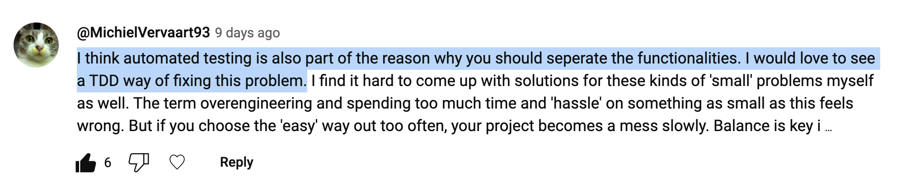
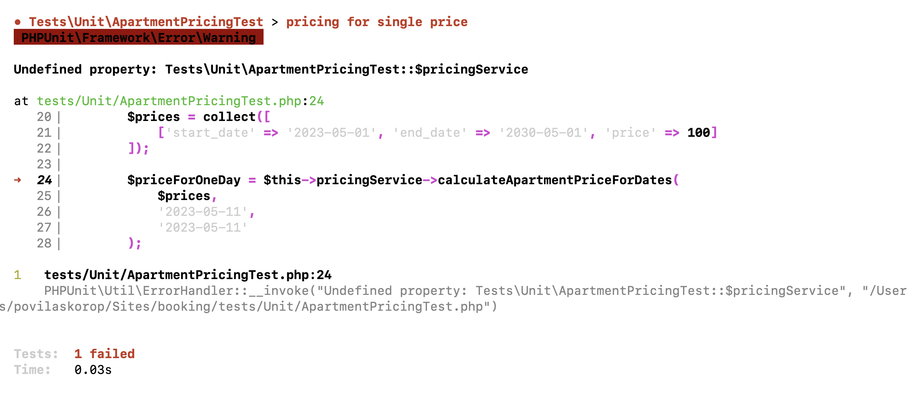
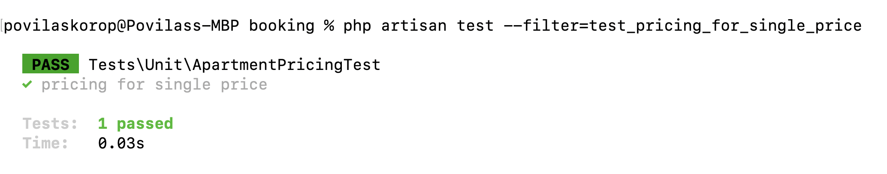

In this lesson, let's practice TDD with Unit tests. We will try to refactor one Apartment model feature and write a Unit test for it, instead of the existing Feature test. I will explain the differences along the way.

The idea came from my YouTube channel where I [posted the idea](https://www.youtube.com/watch?v=2oJIYfj6Lq4) of refactoring this Model function into a Service:

**app/Models/Apartment.php**:
```php
public function calculatePriceForDates($startDate, $endDate)
{
    // Convert to Carbon if not already
    if (!$startDate instanceof Carbon) {
        $startDate = Carbon::parse($startDate)->startOfDay();
    }
    if (!$endDate instanceof Carbon) {
        $endDate = Carbon::parse($endDate)->endOfDay();
    }

    $cost = 0;

    while ($startDate->lte($endDate)) {
        $cost += $this->prices->where(function (ApartmentPrice $price) use ($startDate) {
            return $price->start_date->lte($startDate) && $price->end_date->gte($startDate);
        })->value('price');
        $startDate->addDay();
    }

    return $cost;
}
```

And I got a few comments: how about making this service **testable**? 


Not only that, maybe we should try **TDD**?



Fair enough, let's try to do exactly that.

---

## Why UNIT Test Here?

Before getting to the code syntax, let's start with **WHY** you would do that.

Currently, we have calculations of apartment prices which are not easy to test with automated tests. 

Well, in fact, we do have Feature tests for exactly that, remember?

**tests/Feature/ApartmentPriceTest.php**:
```php
class ApartmentPriceTest extends TestCase
{
    use RefreshDatabase;

    private function create_apartment(): Apartment
    {
        $owner = User::factory()->create(['role_id' => Role::ROLE_OWNER]);
        $cityId = City::value('id');
        $property = Property::factory()->create([
            'owner_id' => $owner->id,
            'city_id' => $cityId,
        ]);

        return Apartment::create([
            'name' => 'Apartment',
            'property_id' => $property->id,
            'capacity_adults' => 3,
            'capacity_children' => 2,
        ]);
    }

    public function test_apartment_calculate_price_1_day_correctly()
    {
        $apartment = $this->create_apartment();
        ApartmentPrice::create([
            'apartment_id' => $apartment->id,
            'start_date' => now()->toDateString(),
            'end_date' => now()->addDays(10)->toDateString(),
            'price' => 100
        ]);

        $totalPrice = $apartment->calculatePriceForDates(
            now()->toDateString(),
            now()->toDateString()
        );
        $this->assertEquals(100, $totalPrice);
    }

    public function test_apartment_calculate_price_2_days_correctly()
    {
        $apartment = $this->create_apartment();
        ApartmentPrice::create([
            'apartment_id' => $apartment->id,
            'start_date' => now()->toDateString(),
            'end_date' => now()->addDays(10)->toDateString(),
            'price' => 100
        ]);

        $totalPrice = $apartment->calculatePriceForDates(
            now()->toDateString(),
            now()->addDay()->toDateString()
        );
        $this->assertEquals(200, $totalPrice);
    }

    public function test_apartment_calculate_price_multiple_ranges_correctly()
    {
        $apartment = $this->create_apartment();
        ApartmentPrice::create([
            'apartment_id' => $apartment->id,
            'start_date' => now()->toDateString(),
            'end_date' => now()->addDays(2)->toDateString(),
            'price' => 100
        ]);
        ApartmentPrice::create([
            'apartment_id' => $apartment->id,
            'start_date' => now()->addDays(3)->toDateString(),
            'end_date' => now()->addDays(10)->toDateString(),
            'price' => 90
        ]);

        $totalPrice = $apartment->calculatePriceForDates(
            now()->toDateString(),
            now()->addDays(4)->toDateString()
        );
        $this->assertEquals(3*100 + 2*90, $totalPrice);
    }
}
```

But, to launch this test method, we need to prepare things in the database:

- "Core" seeders
- Create a Property and Apartment Eloquent models 
- Collection of Prices for that apartment

And the problem is that it's quite "expensive" to launch all the migrations, seeds, and factories with data, just to test if the **calculation** of the prices is correct.

What if we could separate that calculation of prices into its own method which would accept something like an array of prices and dates, and would return the calculated price? 

In other words, that method wouldn't know or "care" where those prices come from: the real database, some fake database, or just a simulation.

This is exactly where the **unit** test comes in: that method would be exactly the "unit" that we could write a test for, without touching the database or launching any API endpoints. 

So, currently, we have the `tests/Feature` folder but will add a test in the `tests/Unit` folder of Laravel.

Such a unit test would not only perform faster but will also allow the separation of concerns, so some developers could work on improving/fixing JUST that price calculation function, without knowing how its data is stored in the DB.

---

## Step-by-step with TDD

Now, in addition to separating the calculation into its own method and class, we want to simulate what would it be like to do it the Test-Driven Development way.

I know this is "cheating" in a way because we already have that method written, so it won't be strictly a "test-first" approach. But still, I want to show you the **thought process** behind it.

---

## Thought 1. We need a Test Method to Check Price Calculations.

This is where you start with TDD. By writing a test for the functionality that does not yet exist. You call the functions in the code how you would WANT to use them, and then actually implement them afterward.

And yes, that means that tests will fail at first. That's the whole point: the game then becomes "make the tests green".

```sh
php artisan make:test ApartmentPricingTest --unit
```

See that `--unit` flag? It means two things:

- Laravel will generate the test file in the `tests/Unit` and not the `tests/Feature` folder
- The new test class will extend a different core class of `PHPUnit\Framework\TestCase` and not Laravel's `Tests\TestCase`

And let's write our first test, which will obviously fail.

```php
namespace Tests\Unit;

use PHPUnit\Framework\TestCase;

class ApartmentPricingTest extends TestCase
{
    public function test_pricing_for_single_price(): void
    {
        $prices = collect([
            [
            	'start_date' => '2023-05-01', 
            	'end_date' => '2030-05-01', 
            	'price' => 100
            ]
        ]);

        $priceForOneDay = $this->pricingService->calculateApartmentPriceForDates(
            $prices,
            '2023-05-11',
            '2023-05-11'
        );

        $this->assertEquals(100, $priceForOneDay);
    }
}
```

This is what I came up with: we need to have a collection of prices, pass that to some service method with the dates of booking, and check if the result is correct.

The main point is that the service should not work with DB, just with the input you gave to it.

For now, we don't have any `pricingService` yet, so this is the result:



And that's OKAY. But the point is that our test acts almost like a specification of how we should write the implementation in the code.

---

## Thought 2. Let's create a Price Calculation Service/Method.

I decided we call that separate class `PricingService`, because there may be other pricing methods in the future.

Here's the code, with logic mostly copy-pasted from the Model method at the beginning of this lesson:

**app/Services/PricingService.php**:
```php
namespace App\Services;

use Carbon\Carbon;
use Illuminate\Support\Collection;

class PricingService
{
    public function calculateApartmentPriceForDates(
        Collection $apartmentPrices,
        ?string $startDate,
        ?string $endDate): int
    {
        $cost = 0;

        $startDate = Carbon::parse($startDate)->startOfDay();
        $endDate = Carbon::parse($endDate)->endOfDay();

        while ($startDate->lte($endDate)) {
            $cost += $apartmentPrices->where(function ($price) use ($startDate) {
                return Carbon::parse($price['start_date'])->lte($startDate)
                    && Carbon::parse($price['end_date'])->gte($startDate);
            })->value('price');
            $startDate->addDay();
        }

        return $cost;
    }
}
```

Things to note here:

- Very clear method name: `calculateApartmentPriceForDates()`
- Method parameters and return types are clear
- As mentioned previously, this method doesn't have any dependency on the database or factories, only uses Carbon as a helper

Now, how do we initialize that Service in the Test? We could do it inline as just `new PricingService()`, but I envision in the future we will have more calculation methods, so let's move it to the `setUp()`:

```php
namespace Tests\Unit;

use App\Services\PricingService;
use PHPUnit\Framework\TestCase;

class ApartmentPricingTest extends TestCase
{
    private PricingService $pricingService;

    public function setUp(): void
    {
        parent::setUp();
        $this->pricingService = new PricingService();
    }

    public function test_pricing_for_single_price(): void
    {
        $prices = collect([
            ['start_date' => '2023-05-01', 'end_date' => '2030-05-01', 'price' => 100]
        ]);

        $priceForOneDay = $this->pricingService->calculateApartmentPriceForDates(
            $prices,
            '2023-05-11',
            '2023-05-11'
        );
        $this->assertEquals(100, $priceForOneDay);
    }
}
```

And now we re-launch... and see green color!



So, this is the essence of TDD: you first write the test and then implement the code, and then iterate change both the test and the code to make it work.

Of course, again, in this case, it was a bit of "cheating" because I had that logic of calculation already implemented earlier in the Model, just needed to tweak it a bit after copy-pasting. But I hope you still get the idea.

---

## Thought 3. Let's Add More Methods/Cases to the Test

Now, this is where you should feel the real benefits of the Unit test and separate Service class.

We can easily create more methods calling that Service, simulating the calculation with different prices and different booking dates. All without touching the database or creating objects with Factory/Faker, which means they would execute much faster.

So, after adding a few more assertions and methods for various cases, this is the final code of our Unit test:

**tests/Unit/ApartmentPricingTest.php**:
```php
namespace Tests\Unit;

use App\Services\PricingService;
use PHPUnit\Framework\TestCase;

class ApartmentPricingTest extends TestCase
{
    private PricingService $pricingService;

    public function setUp(): void
    {
        parent::setUp();
        $this->pricingService = new PricingService();
    }

    public function test_pricing_for_single_price(): void
    {
        $prices = collect([
            ['start_date' => '2023-05-01', 'end_date' => '2030-05-01', 'price' => 100]
        ]);

        $priceForOneDay = $this->pricingService->calculateApartmentPriceForDates(
            $prices,
            '2023-05-11',
            '2023-05-11'
        );
        $this->assertEquals(100, $priceForOneDay);

        $priceForTwoDays = $this->pricingService->calculateApartmentPriceForDates(
            $prices,
            '2023-05-11',
            '2023-05-12'
        );
        $this->assertEquals(2 * 100, $priceForTwoDays);
    }

    public function test_pricing_for_multiple_price_ranges(): void
    {
        $prices = collect([
            ['start_date' => '2023-05-01', 'end_date' => '2023-05-10', 'price' => 100],
            ['start_date' => '2023-05-11', 'end_date' => '2023-06-01', 'price' => 90],
        ]);

        $priceForOneDayFirstRange = $this->pricingService->calculateApartmentPriceForDates(
            $prices,
            '2023-05-01',
            '2023-05-01'
        );
        $this->assertEquals(100, $priceForOneDayFirstRange);

        $priceForTwoDaysSecondRange = $this->pricingService->calculateApartmentPriceForDates(
            $prices,
            '2023-05-11',
            '2023-05-12'
        );
        $this->assertEquals(2 * 90, $priceForTwoDaysSecondRange);

        $priceForMultipleDaysBothRanges = $this->pricingService->calculateApartmentPriceForDates(
            $prices,
            '2023-05-09',
            '2023-05-12'
        );
        $this->assertEquals(2 * 100 + 2 * 90, $priceForMultipleDaysBothRanges);
    }
}
```

Of course, you can add more methods and test cases, under the same idea.

---

## Finish Refactoring: No More Model Method

One of the goals of this whole change was not only to write a Unit test but also to decouple that calculation from the Model.

So now, we have the Service and Unit test, time to perform the "clean up":

- We delete the method `calculatePriceForDates()` from the `Apartment` Model, as well as `use Carbon\Carbon` on top of the Model
- We change both places where that method was used
- We delete the Feature test `tests/Feature/ApartmentPriceTest.php`

**app/Observers/BookingObserver.php**:
```php
use App\Models\Booking;
use App\Services\PricingService;

class BookingObserver
{
    public function creating(Booking $booking)
    {
        // OLD:
        // $booking->total_price = $booking->apartment->calculatePriceForDates(
        //     $booking->start_date,
        //     $booking->end_date
        // );

        // NEW:
        $booking->total_price = (new PricingService())->calculateApartmentPriceForDates(
            $booking->apartment->prices,
            $booking->start_date,
            $booking->end_date
        );
    }
}
```

And here:

**app/Http/Resources/ApartmentSearchResource.php**:
```php
namespace App\Http\Resources;

use App\Services\PricingService;

class ApartmentSearchResource extends JsonResource
{
    public function toArray(Request $request): array
    {
        return [
        	// OLD:
            // 'price' => $this->calculatePriceForDates($request->start_date, $request->end_date)
            'price' => (new PricingService())->calculateApartmentPriceForDates($this->prices, $request->start_date, $request->end_date)
        ];
    }
}
```

That's it, we've refactored the method and created our first **Unit** test!